# 在 Power BI 中使用书签共享见解和创建情景 
使用 Power BI 中的“书签”，可以帮助捕获当前配置的报表页视图（包括视觉对象的筛选器和状态），然后只需选择保存的书签即可恢复相应状态。 

还可以创建一系列书签，按所需的顺序进行排列，随后在演示文稿中逐个展示所有书签，以突出显示一系列见解，或要通过视觉对象和报表诠释的情景。 

书签的用途有许多。 可以使用书签跟踪自己的报表创建进度（书签易于添加、删除和重命名），也可以通过创建书签来生成类似于 PowerPoint 的演示文稿，依序逐一展示所有书签，通过报表诠释情景。 书签可能还有其他用途，具体取决于用户认为如何才能最有效地利用书签。

### 启用书签预览功能（2018 年 3 月之前的版本）
自 Power BI Desktop 2018 年 3 月版起，推出通用版的标签功能。 

我们始终建议升级到最新版本。 但是如果你的 Power BI Desktop 版本低于此发布版本，可尝试使用自 Power BI Desktop 2017 年 10 月版起推出的“书签”功能，而且 Power BI 服务中也具有启用了书签的报表。 要启用此预览功能，请依次选择“文件”、“选项和设置”、“选项”和“预览功能”，再选择“书签”旁的复选框。 

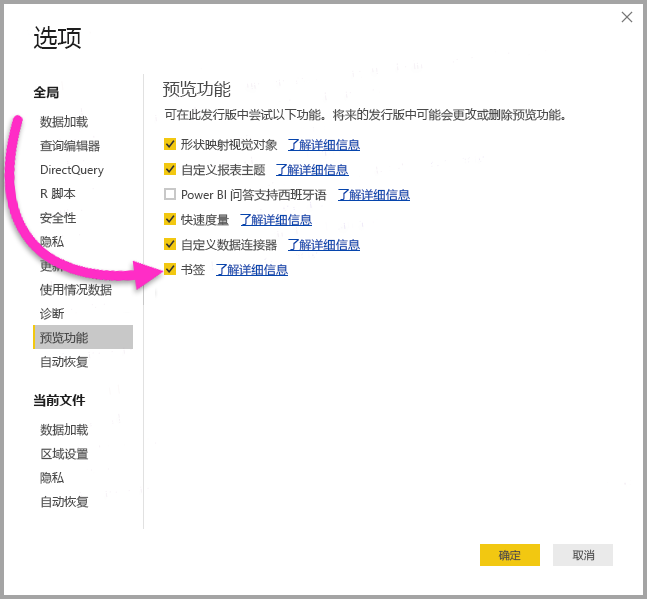

选择启用预览版书签后，需重启 Power BI Desktop。

## 使用书签
若要使用书签，请选择“视图”功能区，再选中“‘书签’窗格”对应的框。 

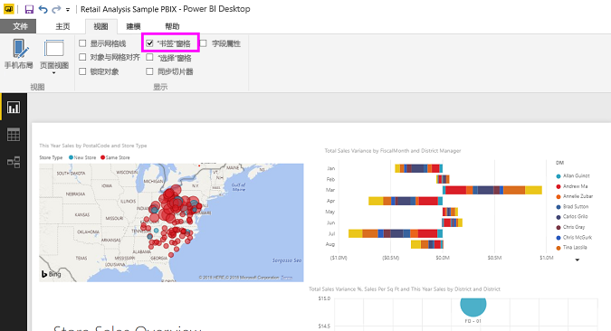

创建书签时，以下元素将与书签一起保存：

* 当前页
* 筛选器
* 切片器
* 排序顺序
* 钻取位置
* 可见性（对象可见性，使用“选择”窗格）
* 任何可见对象的“焦点”或“聚焦”模式

书签暂不保存交叉突出显示状态。 

配置报表页，确保它在书签中的显示效果符合自己的要求。 按照所需方式排列报表页和视觉对象后，选择“书签”窗格中的“添加”，添加一个书签。 

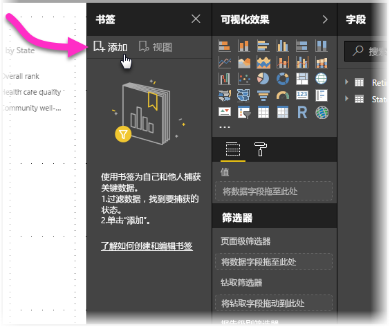

此时，Power BI Desktop 会创建书签，并为其提供一个通用名称。 可以选择书签名称旁边的省略号，再从出现的菜单中选择相应操作，从而轻松地重命名、删除或更新书签。

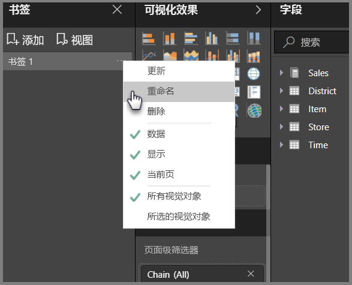

添加书签后，只需单击“书签”窗格中的书签，即可显示它。 

还可以选择是否每个书签都将应用“数据”属性（如筛选器和切片器）、“显示”属性（如聚焦及其可见性），以及页面更改，显示添加书签时可见的页面。 使用书签在视觉对象类型之间切换时，这些功能非常有用，在这种情况下，你可能希望关闭数据属性，因此当用户更改视觉对象类型时，筛选器不会重置。 

要做出此类更改，请选择书签名称旁的省略号，如上图所示，然后勾选或取消选中“数据”、“显示”及其他控件旁边的复选标记。 

## 排列书签
创建书签时，可能会发现，书签的创建顺序不一定就是向受众展示书签的顺序。 这也没问题，因为可以轻松地对书签进行重新排序。

在“书签”窗格中，只需拖放书签，即可更改它们的顺序，如下图所示。 书签之间的黄色栏决定了书签的拖放目标位置。

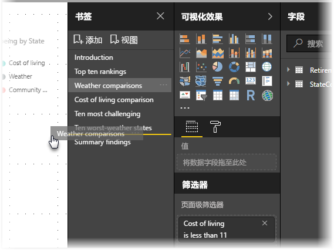

使用书签的“查看”功能时，书签顺序可能会变得非常重要，如下一部分所述。

## 以幻灯片形式放映书签
若要依序展示一系列书签，可以选择“书签”窗格中的“查看”，开始放映幻灯片。

在“查看”模式下，有几项功能值得注意：

1. 书签名称显示在画布底部的书签标题栏中。
2. 书签标题栏中的箭头可用于移到下一个或上一个书签。
3. 可以退出“查看”模式，具体方法为选择“书签”窗格中的“退出”，或选择书签标题栏中的“X”。 

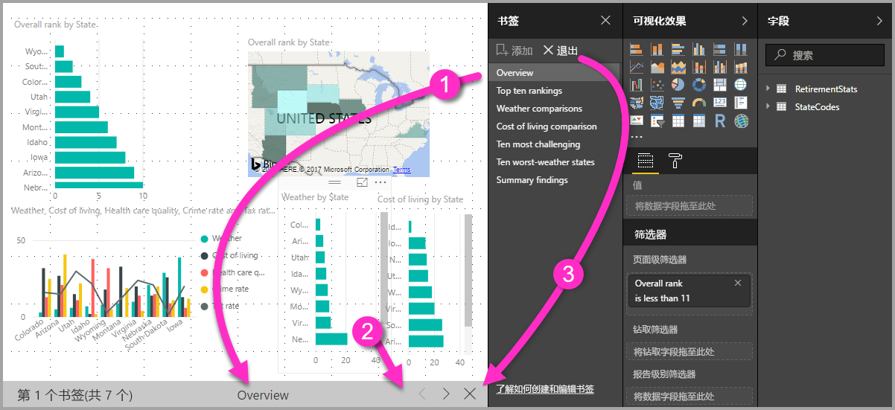

在“查看”模式下，可以关闭“书签”窗格（单击此窗格上的“X”），为演示文稿提供更多空间。 同时，在“查看”模式下，所有视觉对象都可以进行交互和交叉突出显示，就像在其他情况下与它们交互时一样。 

## 可见性 - 使用“选择”窗格
发布书签后，同时也会引入新的“选择”窗格。 “选择”窗格列出了当前页上的所有对象，方便用户选择对象，并指定给定对象是否可见。 

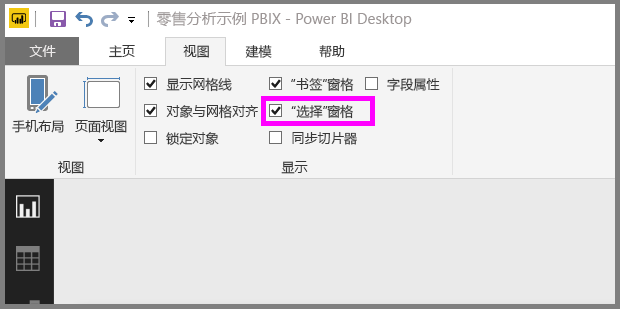

可以使用“选择”窗格选择对象。 此外，还可以单击视觉对象右侧的眼睛图标，切换设置对象当前是否可见。 

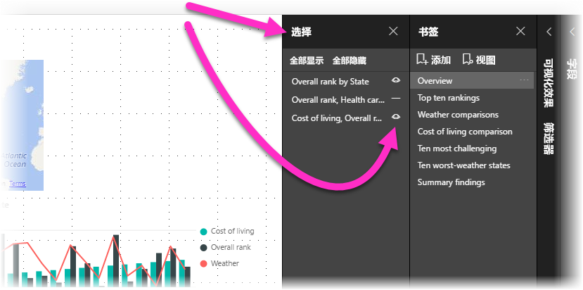

添加书签时，每个对象的可见状态也随之保存，具体视“选择”窗格中的设置而定。 

请务必注意，“切片器”会继续筛选报表页，无论它们是否可见。 因此，可以创建切片器设置不同的多个书签，让一个报表页在各种书签中呈现出截然不同的显示效果（并突出显示不同的见解）。

## 形状和图像的书签关联
还可以将形状和图像与书签相关联。 借助此功能，在单击对象后，将会看到与这个对象相关联的书签。 这可能在使用按钮时特别有用；有关详细信息，请阅读有关[使用 Power BI 中的按钮](desktop-buttons.md)一文。 

若要将书签分配给对象，选择对象，然后展开“设置形状格式”窗格中的“操作”部分，如下图所示。

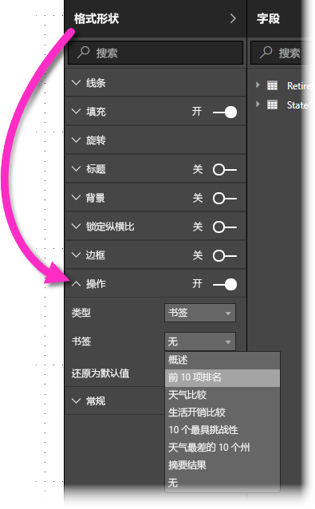

将“操作”滑块移至“开”后，便可以选择对象是后退按钮、书签还是问答命令。 如果选择书签，可以选择要与对象相关联的书签。

对于与书签相关联的对象，可以执行各种有意思的操作。 可以在报表页上创建可视内容表，也可以提供相同信息的不同视图（如视觉对象类型），只需单击对象即可。

在编辑模式下，可以在按住 Ctrl 的同时单击，从而访问关联的书签；在非编辑模式下，只需单击对象，即可访问关联的书签。 

## 使用“聚焦”
与书签一起发布的另一项功能是“聚焦”。 使用“聚焦”，可以吸引用户注意特定图表。例如，在“查看”模式下呈现书签。

比较一下“聚焦”与“焦点”模式，看看它们有何不同。

1. 在“焦点”模式下，可以选择“焦点模式”图标，让一个视觉对象占满整个画布。
2. 使用“聚焦”模式，可以让页面上的其他所有视觉对象淡化到接近透明，从而按原始尺寸突出显示一个视觉对象。 

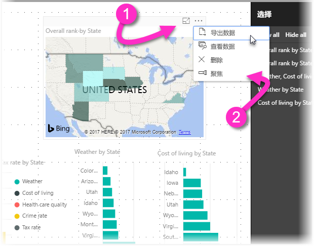

如果在上一张图中单击视觉对象的“焦点”图标，页面如下所示：

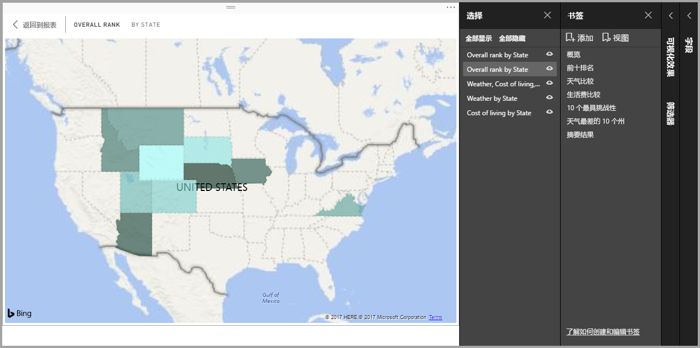

相比之下，如果选择视觉对象的省略号菜单中的“聚焦”，页面如下所示：

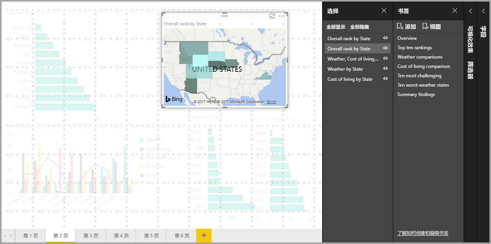

如果在添加书签时选择了上述模式中的任何一种，书签中会一直保留此模式（“焦点”或“聚焦”）。

## Power BI 服务中的书签
将包含至少一个书签的报表发布到 Power BI 服务后，可以在 Power BI 服务中查看这些书签，并与之交互。 在报表中创建书签后，可以依次选择“视图”和“‘选择’窗格”，也可以依次选择“视图”和“‘书签’窗格”，从而显示每个窗格。

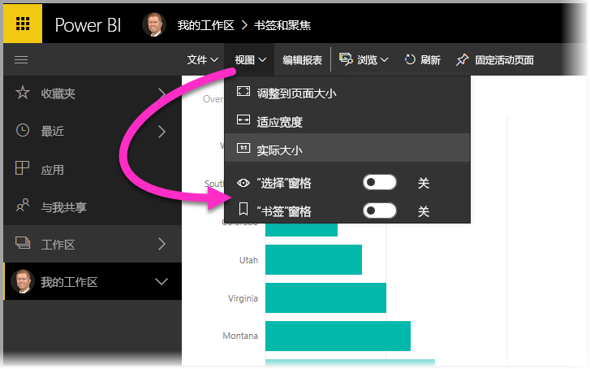

在 Power BI 服务中，“书签”窗格的使用方式与在 Power BI Desktop 中一样，包括可以选择“查看”功能，依序展示书签，如同放映幻灯片一样。

请注意，必须使用灰色书签标题栏来浏览书签，而不是黑色箭头（黑色箭头用于切换报表页，而非书签）。

## 限制和注意事项
这一版“书签”功能有一些限制和注意事项。

* 大多数自定义视觉对象应该能够与书签很好地配合使用。 如果在使用书签和自定义视觉对象时遇到问题，请与该自定义视觉对象的创建者联系，并要求他们向视觉对象添加书签支持。 
* 如果在创建书签后在报表页上添加视觉对象，此视觉对象将以默认状态显示。 也就是说，如果在之前创建书签的页面中引入切片器，此切片器将在默认状态下运行。
* 创建书签后，如果移动视觉对象，书签中也会予以反映。 

## 后续步骤
若要详细了解与书签类似的功能或如何与书签交互，请参阅以下文章：

* [在 Power BI Desktop 中使用钻取](desktop-drillthrough.md)
* [在“焦点”模式下显示仪表板磁贴或报表视觉对象](service-focus-mode.md)

