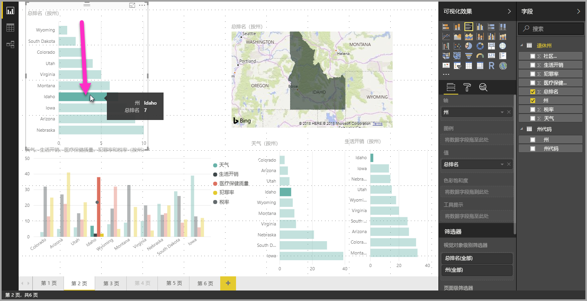
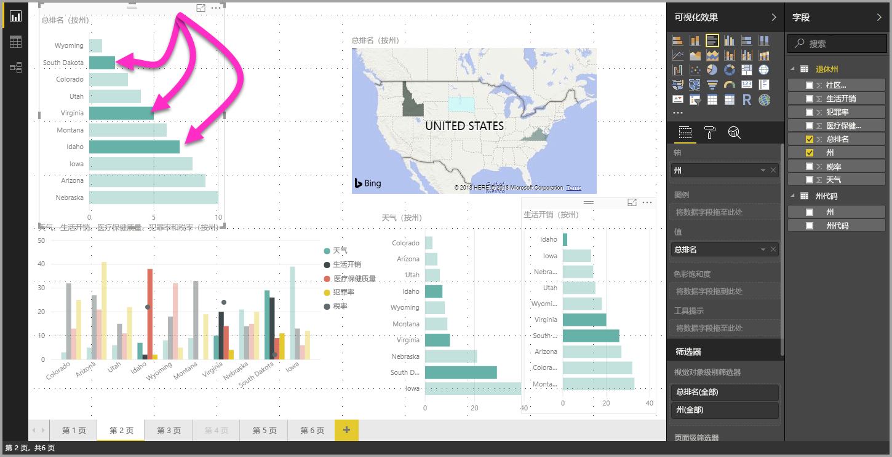

# 使用 Power BI Desktop 在视觉对象中选择多个数据元素

在 Power BI Desktop 中，只需单击给定视觉对象中的数据点即可突出显示该视觉对象中的数据点。 例如，如果你有重要的条形图或图表元素，并且希望报表页上的其他视觉对象根据你的选择突出显示数据，可以单击一个视觉对象中的数据元素并查看反映在页面上的其他视觉对象中反映的结果。 这是基本的或单项选择突出显示。 下图显示了基本突出显示。 

借助多重选择，现在可以在 Power BI Desktop 报表页中选择多个数据点，并突出显示页面上所有视觉对象中的结果。 这相当于 and 语句或功能，如“highlight results for Idaho and Virginia”（突出显示爱达荷州和弗吉尼亚州的结果）。 若要在视觉对象选择多个数据点，只需使用“CTRL+单击”选择多个数据点。 下图显示了选择的多个数据点（多重选择）。

此功能看似很简单，但在创建、共享报表和与报表交互时，它会启发各种可能性。 

## 后续步骤

你可能还会对以下文章感兴趣：

* [在 Power BI Desktop 报表中使用网格线和对齐网格](desktop-gridlines-snap-to-grid.md)
* [关于 Power BI 报表中的筛选器和突出显示](power-bi-reports-filters-and-highlighting.md)

