# 在 Power BI 中使用 R 驱动的自定义视觉对象
在 Power BI Desktop 和 Power BI 服务中，无需掌握任何 R 知识，也无需使用任何 R 脚本，即可使用 R 驱动的自定义视觉对象。 这样一来，无需学习任何 R 知识，也无需自行进行任何编程，即可利用 R 视觉对象和 R 脚本的分析和视觉功能。

若要使用 R 驱动的自定义视觉对象，请先从 Power BI 自定义视觉对象的 [AppSource](https://appsource.microsoft.com/marketplace/apps?product=power-bi-visuals&page=1) 库中选择并下载要使用的 R 自定义视觉对象。

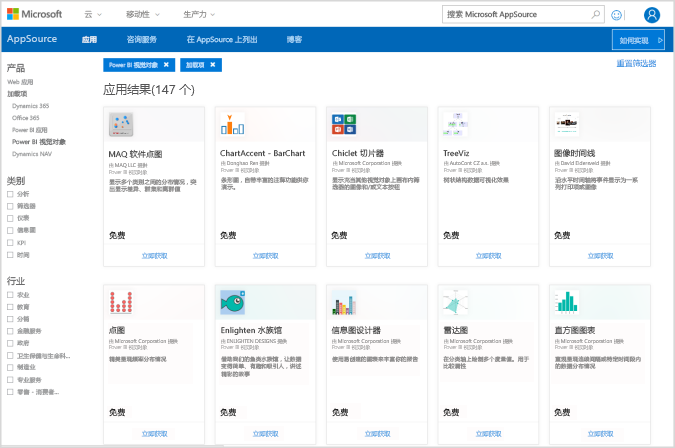

以下部分介绍了如何在 **Power BI Desktop** 中选择、加载和使用 R 驱动的视觉对象。

## 使用 R 自定义视觉对象
若要使用 R 驱动自定义视觉对象，请从“自定义视觉对象”库下载每个视觉对象，然后在 Power BI Desktop 中如使用其他任何类型的视觉对象一样来使用此视觉对象。 获取自定义视觉对象的方法有两种，可以从在线 AppSource 网站下载视觉对象，也可以在 Power BI Desktop 中浏览并获取视觉对象。 

### 从 AppSource 获取自定义视觉对象

若要在在线 AppSource 网站中浏览并选择视觉对象，请按照以下步骤操作：

1. 转到 [https://appsource.microsoft.com](https://appsource.microsoft.com/) 中的 Power BI 视觉对象库。选中“按产品细分”下的“Power BI 应用”复选框，再单击“查看全部”链接。
   
   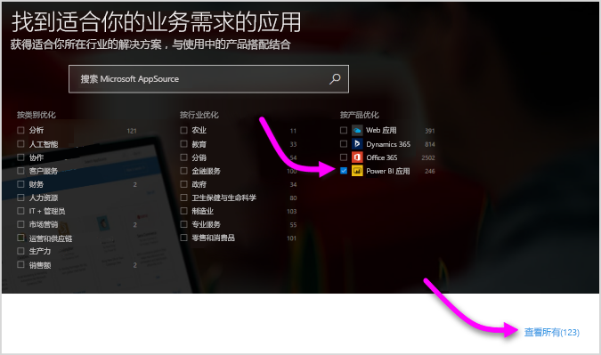

2. 在[“Power BI 视觉对象”](https://appsource.microsoft.com/marketplace/apps?product=power-bi-visuals&page=1)库页面，从左侧窗格内的加载项列表中，选择“Power BI 视觉对象”。

   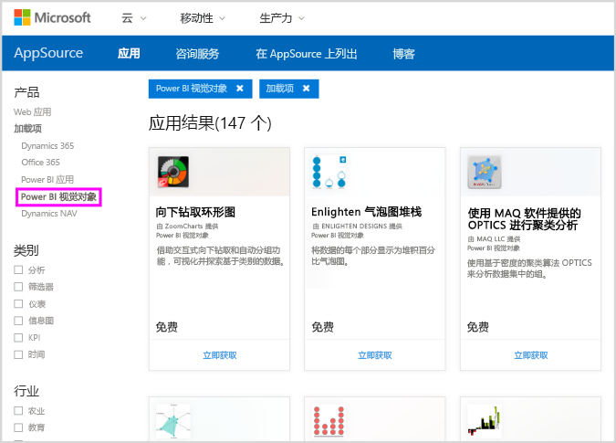

3. 从库中选择要使用的视觉对象，此时将会转到视觉对象的说明页。 选择“立即获取”按钮，下载视觉对象。
   
   > [!NOTE]
    > 若要在 Power BI Desktop 中创作，需要在本地计算机上安装 R。 但用户要在 Power BI 服务中查看 R 驱动的视觉对象时，他们不需要在本地安装 R。
   > 
   > 
   
   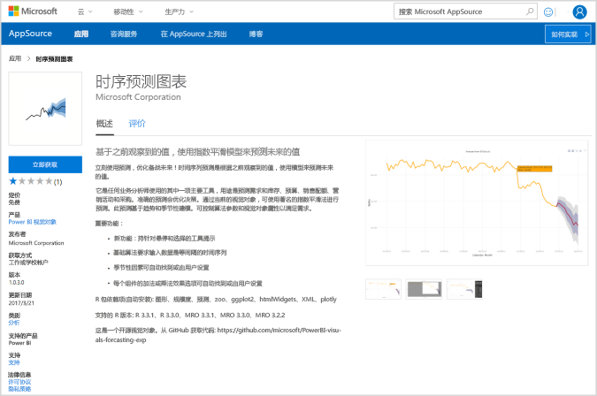
   
   无需安装 R 即可在 **Power BI 服务**中使用 R 驱动的自定义视觉对象。不过，如果要在 **Power BI Desktop** 中使用 R 驱动的自定义视觉对象，则必须在本地计算机上安装 R。 可以从以下位置下载 R：
   
   * [CRAN](https://cran.r-project.org/)
   * [MRO](https://mran.microsoft.com/)

4. 下载视觉对象（与在浏览器中下载任何文件一样）后，立即转到“Power BI Desktop”，单击“可视化效果”窗格中的省略号 (...)，再选择“从文件导入”。
   
   
5. 导入自定义视觉对象时的注意事项，具体如下图所示：
   
   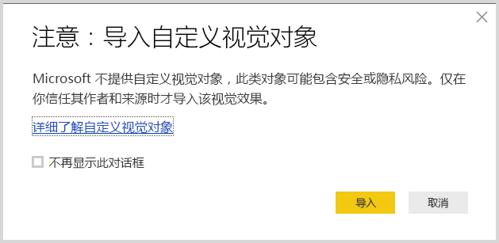
6. 导航到视觉对象文件保存的位置，然后选择该文件。 **Power BI Desktop** 自定义可视化效果具有.pbiviz 扩展名。
   
   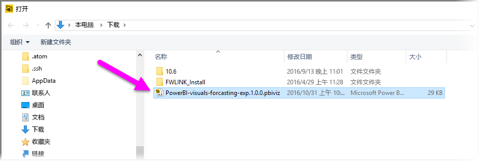
7. 返回 Power BI Desktop 时，你可以在“**可视化效果**”窗格中看到新的视觉对象类型。
   
   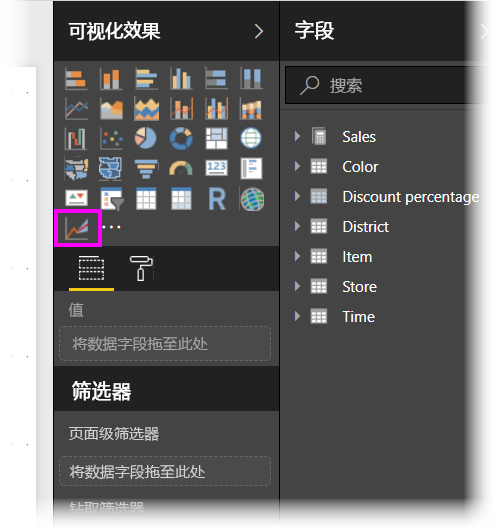
8. 在你导入新的视觉对象（或打开包含 R 驱动的自定义视觉对象的报表）后，**Power BI Desktop** 便会安装相应的 R 包。
   
   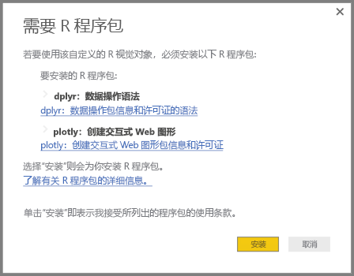

9. 在这里，你将数据添加到视觉对象，如添加到任何其他 **Power BI Desktop** 视觉对象一样。 完成后，你可以在画布上看到完成的视觉对象。 在下面的视觉对象中，R 驱动的视觉对象 **Forecasting** 与联合国 (UN) 出生速率预测一同使用（左侧的视觉对象）。

    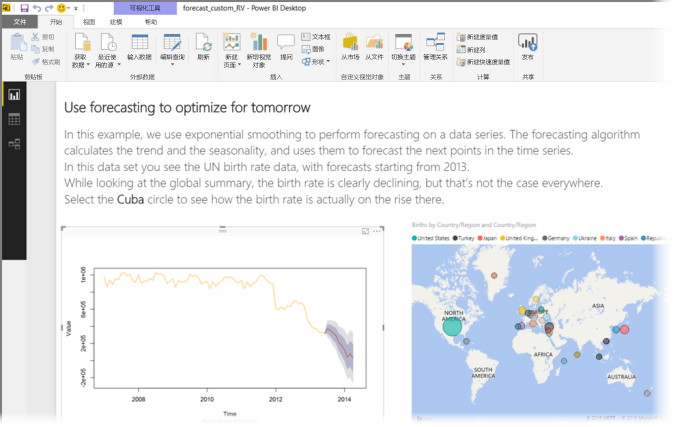

    如任何其他 **Power BI Desktop** 视觉对象一样，你可以将此报表及其 R 驱动的视觉对象发布到 **Power BI 服务**并与他人共享。

    请经常检查库，因为会随时添加新视觉对象。

### 在 Power BI Desktop 中获取自定义视觉对象

1. 也可以从 Power BI Desktop 获取自定义视觉对象。 在“Power BI Desktop”中，单击“可视化效果”窗格中的省略号 (...)，再选择“从 Marketplace 导入”。
   
   

2. 此时，将会看到“Power BI 视觉对象”对话框。在此对话框中，可以滚动浏览可用自定义视觉对象，并能选择要使用的视觉对象。 可以按名称搜索，可以选择类别，也可以直接滚动浏览可用视觉对象。 准备就绪后，只需选择“添加”，即可将自定义视觉对象添加到“Power BI Desktop”。

   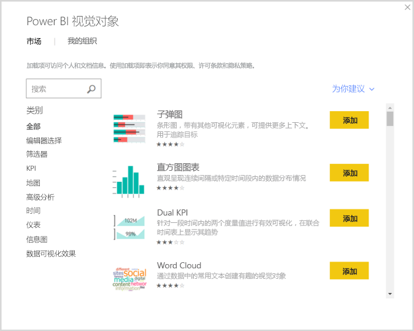

## 参与 R 驱动的自定义视觉对象
如果你创建自己的 R 视觉对象以供在报表中使用，则可以向**自定义视觉对象库**提供你的自定义视觉对象，从而与全世界共享你的视觉对象。 通过 GitHub 进行贡献，相应过程在以下位置有所讲述：

* [贡献到 R 驱动的自定义视觉对象库](https://github.com/Microsoft/PowerBI-visuals#building-r-powered-custom-visual-corrplot)

## R 驱动的自定义视觉对象疑难解答
必须满足 R 驱动的自定义视觉对象的特定依存关系，视觉对象才能正常运行。 如果 R 驱动的自定义视觉对象未运行或未正常加载，通常是出现下面的一种问题：

* R 引擎缺失
* 视觉对象基于的 R 脚本出错了
* R 包缺失或已过期

下面的部分介绍了你可以用来解决可能会遇到的问题的故障排除步骤。

### R 包缺失或已过期
在尝试安装 R 驱动的自定义视觉对象时，如果 R 包缺失或已过期，则可能会看到错误；通常可能是由于如下一种原因所致：

* R 安装与 R 包不兼容
* 防火墙、防病毒软件或代理设置阻止 R 连接 Internet
* Internet 连接速度慢或无法连接 Internet

Power BI 团队正在努力降低你遇到这些问题的可能性，下一版 Power BI Desktop 将包含用于解决这些问题的更新程序。 在此之前，你可以按以下一个或多个步骤操作，从而降低遇到这些问题的可能性：

1. 删除自定义视觉对象，然后重新安装。 这会重新开始安装 R 包。
2. 如果安装的 R 不是最新版，请升级 R 安装，然后删除并重新安装自定义视觉对象，如上一步所述。
   
   每个 R 驱动的自定义视觉对象的描述中列出了支持的 R 版本，如下图所示。
   
     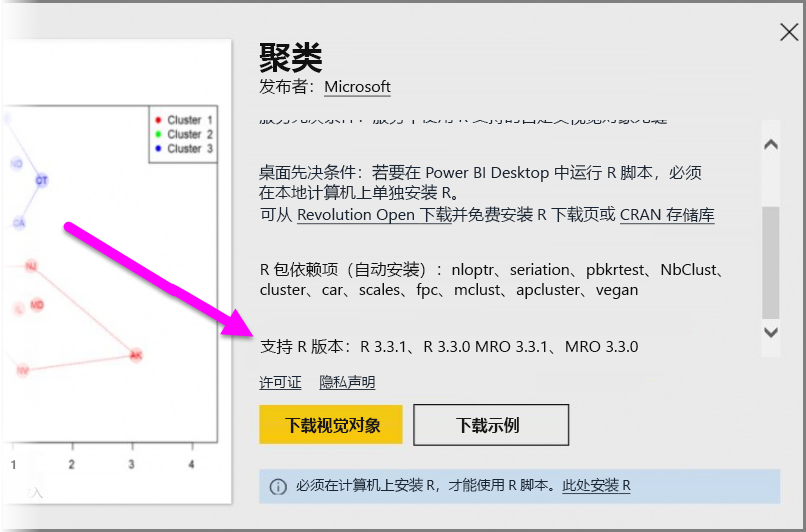
     > [!NOTE]
    > 可以保留原始 R 安装，仅将 Power BI Desktop 与当前安装的版本相关联。 依次转到“**文件 > 选项和设置 > 选项 > R 脚本**。
    >
    >
3. 使用任意 R 控制台手动安装 R 包。 此方法的具体步骤如下所示：
   
   a.  下载 R 驱动的视觉对象安装脚本，然后将该文件保存到本地驱动器。
   
   b.  在 R 控制台中运行以下命令：
   
       > source(“C:/Users/david/Downloads/ScriptInstallPackagesForForecastWithWorkarounds.R”)    
   
   典型的默认安装位置如下所示：
   
       c:\Program Files\R\R-3.3.x\bin\x64\Rterm.exe (for CRAN-R)
       c:\Program Files\R\R-3.3.x\bin\x64\Rgui.exe (for CRAN-R)
       c:\Program Files\R\R-3.3.x\bin\R.exe (for CRAN-R)
       c:\Program Files\Microsoft\MRO-3.3.x\bin\R.exe (for MRO)
       c:\Program Files\Microsoft\MRO-3.3.x\bin\x64\Rgui.exe (for MRO)
       c:\Program Files\RStudio\bin\rstudio.exe (for RStudio)
4. 如果上述步骤不起作用，请尝试按以下步骤操作：
   
   a. 使用 **R Studio**，按上述 3.b. 中所述的步骤操作 （在 R 控制台中运行脚本代码）。
   
   b. 如果上一步不起作用，请更改 **R Studio** 中的“**工具 > 全局选项 > 包**”，并选中**将 Internet Explorer 库/代理用于 HTTP** 复选框，然后重复执行 上述 3.b. 中的步骤。

## 后续步骤
查看以下更多信息，了解有关 Power BI 中的 R。

* [Power BI 自定义视觉对象库](https://app.powerbi.com/visuals/)
* [在 Power BI Desktop 中运行 R 脚本](desktop-r-scripts.md)
* [在 Power BI Desktop 中创建 R 视觉对象](desktop-r-visuals.md)
* [将外部 R IDE 与 Power BI 一起使用](desktop-r-ide.md)

