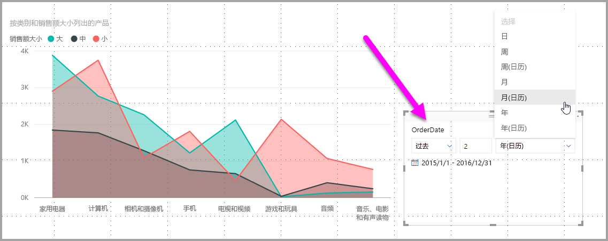
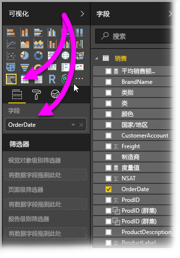
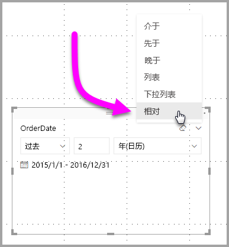
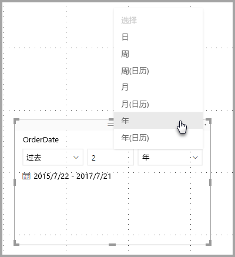
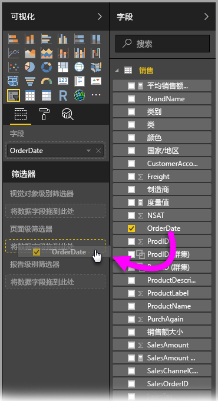
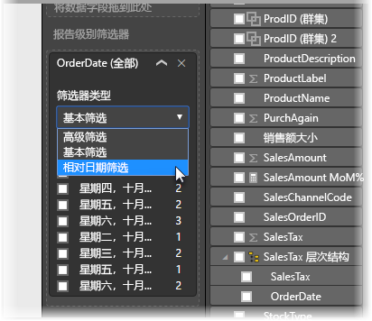
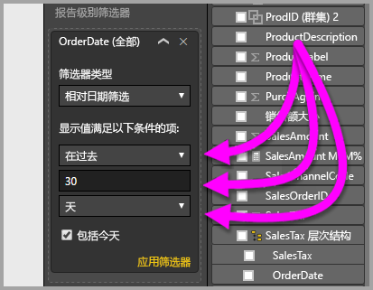

# 在 Power BI Desktop 中使用相对日期切片器和筛选器
借助相对日期切片器或筛选器，可以向数据模型中的任意日期列应用时间筛选器。 例如，可以使用相对日期切片器，仅显示过去 30 天（或月、日历月等）的销售数据。 刷新数据时，相对时间段会自动应用相应的相对日期约束。

## 使用相对日期范围切片器
相对日期切片器的使用方法与其他任何切片器的使用方法一样。 只需为报表创建切片器视觉对象，再选择日期值作为“字段”值即可。 在下图中，选择的是“订购日期”字段。

选择“相对日期切片器”右上角的脱字号。此时，系统会显示菜单。

若要使用相对日期切片器，请选择“相对”。

然后，可以选择设置。 对于“相对日期切片器”中的第一个下拉列表，可以选择下列选项：

* 最后一个
* 下一步
* 此

这些选项如下图所示。

通过“相对日期切片器”中的“下一个(中间)”设置，可以键入一个数字来定义相对日期范围。

可以通过第三个设置选择日期度量值。 可以选择下列选项：

* 日
* 周
* 周（日历）
* 月
* 月（日历）
* 年
* 年（日历）

这些选项如下图所示。

如果从该列表中选择“月”，并在中间设置中输入 2，将发生以下情况：如果今天是 7 月 20 日，那么切片器约束的视觉对象会显示前两个月的数据，即从 5 月 20 日一直到 7 月 20 日（今天的日期）。

相比之下，如果选择“月（日历）”，约束的视觉对象则会显示从 5 月 1 日一直到 6 月 30 日（过去两个整日历月）的数据。

## 使用相对日期范围筛选器
还可以为报表页或整个报表创建相对日期范围筛选器。 为此，只需将日期字段拖到“字段”窗格中的“页面级筛选器”或“报表级筛选器”区域即可，如下图所示。

就位后，可以修改相对日期范围，具体操作与自定义“相对日期切片器”类似。 在“筛选器类型”下拉列表中选择“相对日期筛选”。

选择“相对日期筛选”后，便可以修改三个部分，包括中间的数字框，就像切片器一样。

在报表中使用相对日期约束就是这么简单。

## 限制和注意事项
目前，使用相对日期范围切片器和筛选器时，需要遵循以下限制和注意事项。

* Power BI 中的数据模型不包括时区信息。 模型可以存储时间，但并不指明所在时区。
* 切片器和筛选器始终以 UTC 时间为依据。因此，如果在报表中配置筛选器，并将其发送给位于不同时区的同事，看到的数据仍相同。 不过，如果你不在 UTC 时区，数据可能会发生与预期不同的时间偏移。
* 可以使用“查询编辑器”，将在本地时区捕获的数据转换为 UTC。

