# 在 Power BI 中自定义视觉对象
创建或编辑 Power BI 报表时，可以使用多种不同类型的视觉对象。 这些视觉对象显示在“可视化效果”窗格中。 下载 Power BI Desktop 或打开 Power BI 服务 (app.powerbi.com) 时，这组视觉对象都已“预打包”。

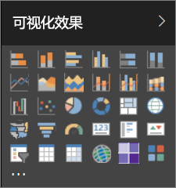

不过，并不是只能使用这组视觉对象，选择省略号可以打开其他报表视觉对象源，即自定义视觉对象。

开发人员使用自定义视觉对象 SDK 创建自定义视觉对象，使业务用户可以使用最适合业务的方式查看他们的数据。 然后，报表作者可以将自定义视觉对象文件导入报表，并将它们用作任何其他 Power BI 视觉对象。 自定义视觉对象是 Power BI 中的“一等公民”，可以对其执行筛选、突出显示、编辑和共享等操作。

自定义视觉对象可以采用 3 种部署形式：
* 自定义视觉对象文件
* 组织视觉对象
* 市场视觉对象

## 自定义视觉对象文件

自定义视觉对象是包含用于呈现数据的代码的包，其中此数据为自定义视觉对象服务。 任何人都可以创建自定义视觉对象并将其打包为可导入 Power BI 报表的单个 .pbiviz 文件。

> [!WARNING]
> 自定义视觉对象可包含存在安全或隐私风险的代码；在将其导入报表之前，请务必信任自定义视觉对象的作者和来源。
> 
> 

## 组织视觉对象

Power BI 管理员可以将自定义视觉对象部署到他们的组织中，使报表作者可以轻松发现和使用管理员已批准在组织内使用的自定义视觉对象。 这赋予管理员对选择特定自定义视觉对象并在组织中进行部署的控制权限，以及为管理员提供一种简便的方法来管理（即更新版本、禁用/启用）此类视觉对象。 对于报表作者而言，这是发现对组织唯一的视觉对象以及对更新这些视觉对象的无缝支持的一种简便方法。

若要详细了解组织自定义视觉对象，请[详细了解组织视觉对象](power-bi-custom-visuals-organization.md)。

## 市场视觉对象

社区成员以及 Microsoft 已经将自定义视觉对象公开发布到 [AppSource](https://appsource.microsoft.com/en-us/marketplace/apps?product=power-bi-visuals) 市场。 可以下载这些视觉对象，并将它们添加到 Power BI 报表。 所有这些自定义视觉对象都已经过测试并通过 Microsoft 的功能和质量批准。

什么是 AppSource？ 简而言之，可以在其中查找 Microsoft 软件的应用、加载项和扩展。 [AppSource](https://appsource.microsoft.com/en-us/) 为 Office 365、Azure、Dynamics 365、Cortana 和 Power BI 等产品的数百万用户提供解决方案，帮助他们更高效、更有见地或更为完美地完成工作。

### 已认证的视觉对象

Power BI 取得认证的视觉对象是已通过其他严格质量测试的市场视觉对象，支持用于其他情形，如[电子邮件订阅](https://docs.microsoft.com/power-bi/service-report-subscribe)和[导出到 PowerPoint](https://docs.microsoft.com/power-bi/service-publish-to-powerpoint)。
若要查看已认证的自定义视觉对象列表或提交你自己的自定义视觉对象，请参阅[已认证的自定义视觉对象](https://docs.microsoft.com/power-bi/power-bi-custom-visuals-certified)。

你是 Web 开发者吗？对创建自己的可视化效果，并将它们添加到 AppSource 感兴趣吗？ 请参阅[开发人员工具入门](https://docs.microsoft.com/power-bi/service-custom-visuals-getting-started-with-developer-tools)，了解如何[将自定义视觉对象发布到 AppSource](https://appsource.microsoft.com/en-us/marketplace/apps?product=power-bi-visuals)。

### 从文件导入自定义视觉对象

1. 选择“可视化效果”窗格底部的省略号。

    

2. 在下拉列表中，选择“从文件导入”。

    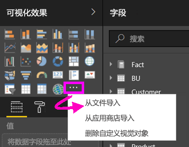

3. 从“打开文件”菜单中，选择你想要导入的 .pbiviz 文件，然后选择“打开”。 现在，自定义视觉对象图标添加到“可视化效果”窗格底部，可供在报表中使用。

    

### 导入组织视觉对象

1. 选择“可视化效果”窗格底部的省略号。

    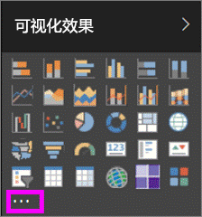

2. 在下拉列表中，选择“从市场导入”。

    

3. 从顶部的选项卡菜单中选择“我的组织”。

    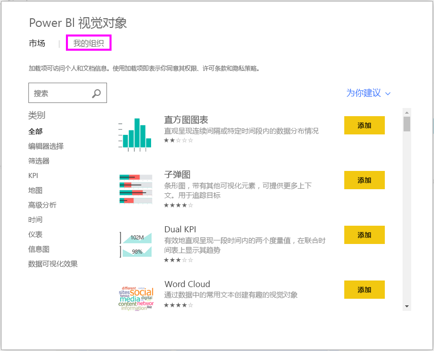

4. 滚动浏览列表，找到要导入的视觉对象。
    
    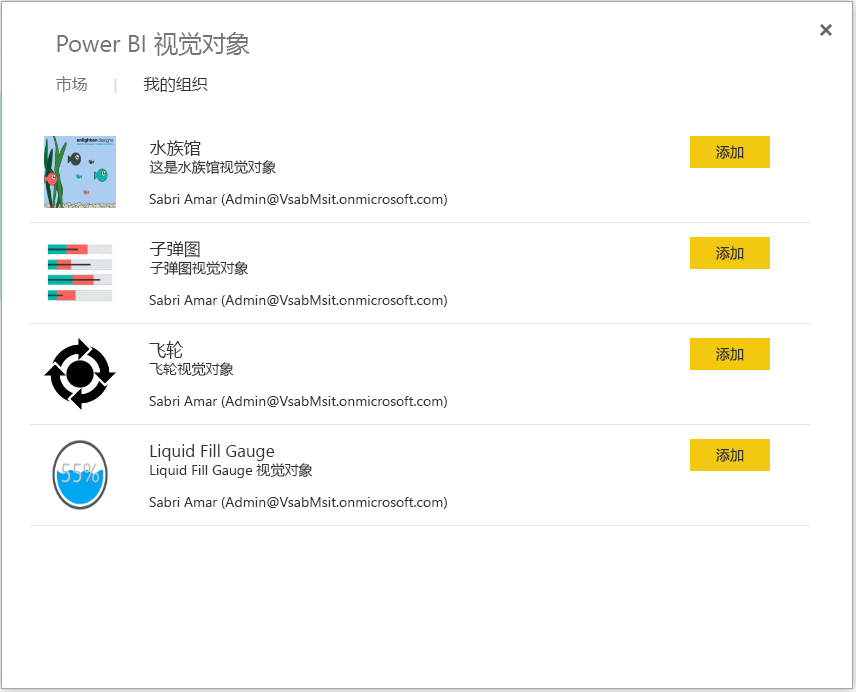

5. 选择“添加”，导入自定义视觉对象。 现在，自定义视觉对象图标添加到“可视化效果”窗格底部，可供在报表中使用。

    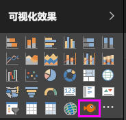
 
## 从 Microsoft AppSource 下载或导入自定义视觉对象
下载和导入自定义视觉对象的方法有两种，可以在 Power BI 中获取，也可以从 AppSource 网站获取。

### 在 Power BI 中导入自定义视觉对象

1. 选择“可视化效果”窗格底部的省略号。

    

2. 在下拉列表中，选择“从市场导入”。

    

3. 滚动浏览列表，找到要导入的视觉对象。

    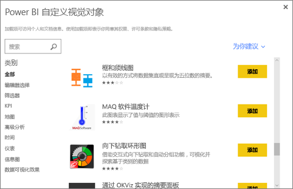

4. 若要详细了解视觉对象之一，请选中它。

    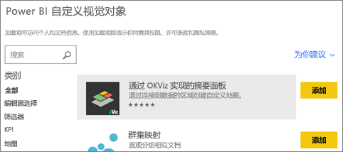

5. 在详细信息页中，可以查看屏幕截图、视频、详细说明等内容。

    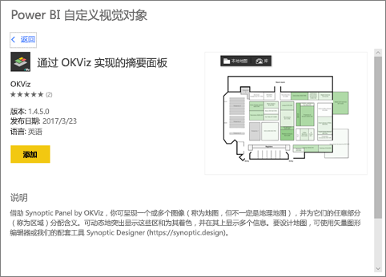

6. 滚动到底部可以查看评论。

    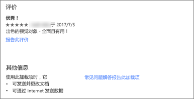

7. 选择“添加”，导入自定义视觉对象。 现在，自定义视觉对象图标添加到“可视化效果”窗格底部，可供在报表中使用。

    

### 从 Microsoft AppSource 下载和导入自定义视觉对象

1. 首先，访问 [Microsoft AppSource](https://appsource.microsoft.com)，并选择“应用”选项卡。 

    

2. 此时，将会转到[“应用结果”页](https://appsource.microsoft.com/en-us/marketplace/apps)。在此页中，可以查看每种类别的热门应用，包括 Power BI 应用。 不过，由于要找的是自定义视觉对象，因此现在选择左侧导航列表中的“Power BI 视觉对象”，从而缩小结果范围。

    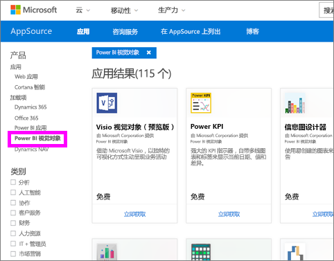

3. AppSource 显示每个自定义视觉对象的磁贴。  每个磁贴均有自定义视觉对象的快照、简短说明和下载链接。 如需了解更多详情，请选择磁贴。 

    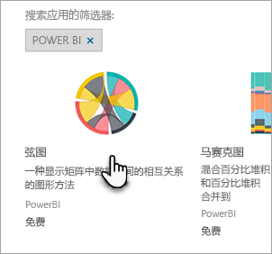

4. 在详细信息页中，可以查看屏幕截图、视频、详细说明等内容。 选择“立即获取”，并同意接受使用条款，下载自定义视觉对象。 

    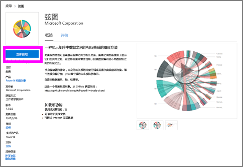

5. 单击自定义视觉对象下载链接。

    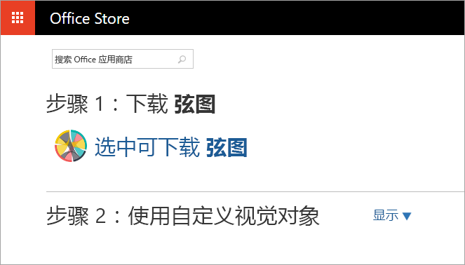

    下载页还介绍了如何将自定义视觉对象导入 Power BI Desktop 和 Power BI 服务。

    还可以下载包含自定义视觉对象并展示其功能的示例报表。

    

6. 保存 .pbiviz 文件，再打开 Power BI。

7. 将 .pbiviz 文件导入报表（请参阅上面的[从文件导入自定义视觉对象](#import-a-custom-visuals-from-a-file)部分）

## 注意事项和疑难解答

- 导入完成后，自定义视觉对象就已添加到特定报表。 若要在其他报表中使用此视觉对象，还需要将它导入相应报表。 使用“另存为”选项保存包含自定义视觉对象的报表时，自定义视觉对象的副本与新报表一同保存。

- 如果看不到“可视化效果”窗格，表示无权编辑报表。  只能将自定义视觉对象添加到有权编辑的报表，不能添加到与自己共享的报表。

更多问题？ [尝试参与 Power BI 社区](http://community.powerbi.com/)
