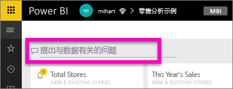
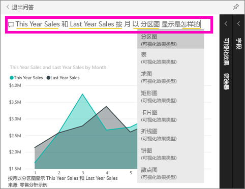

# Power BI 入门问答
## 通过“零售分析示例”使用 Power BI 问答
有时从你的数据中获得答案的最快方法是使用自然语言提问。  本快速入门将介绍如何通过 2 种不同的方法来创建同一可视化效果。第一种方法是在报表中生成可视化效果，第二种方法是使用 Power BI 问答提问。 虽然本文将使用 Power BI 服务，但具体过程几乎与使用 Power BI Desktop 完全相同。

必须使用可以编辑的报表，才能跟着介绍一起操作。因此，本文将使用可用于 Power BI 的示例之一。

## 方法 1：使用报表编辑器
1. 在 Power BI 工作区中，选择“获取数据” \>“示例”\>“零售分析示例” > “连接”。
   
    
2. 仪表板包含“上年度销售额和本年度销售额”的面积图磁贴。  选择此磁贴。 
   
   * 如果此磁贴是使用问答创建的，选择该磁贴将打开 Q&A。 
   * 但是，此磁贴是在报表中创建的，因此将在包含此可视化效果的页中打开报表。
3. 在编辑视图中打开报表，方法是选择**编辑报表**。  如果你不是报表的所有者，则无法在编辑视图中打开报表。
   
    
4. 选择此面积图，然后在**字段**窗格中检查设置。  报表创建者通过选择这 3 个值（“时间”>“会计月份”、“销售额”>“本年度销售额”、“销售额”>“上年度销售额”>“值”），并且在“坐标轴”和“值”框中组织它们来生成此图表。
   
    

## 方法 2：使用问题解答
我们将如何使用问答着手创建相同的折线图？

1. 重新导航到“零售分析示例”仪表板。
2. 使用自然语言，在问题框中键入类似如下内容：
   
   **本年度销售额和上一年度销售额按月以分区图显示是什么**
   
   当你键入问题时，Q&A 选择最佳的可视化效果显示你的回答；并且可视化效果会随着问题的修改而动态更改。 此外，Q&A 还会通过建议、自动完成和拼写更正等功能来帮助你设置问题的格式。
   
   键入你的问题之后，所得到的图表正是我们在报表中看到的同一图表。  但是使用该方式创建要快得多！
   
   
3. 类似于使用报表，在问答中你有权访问“可视化效果”、“筛选器”和“字段”窗格。  打开这些窗格以进一步浏览和修改你的视觉对象。
4. 要将图表固定到仪表板中，请选择固定图标 。

## 后续步骤
[Power BI 中的“问答”](power-bi-q-and-a.md)

[让你的数据在 Power BI 中很好地与“问答”协作](service-prepare-data-for-q-and-a.md)

更多问题？ [尝试参与 Power BI 社区](http://community.powerbi.com/)

