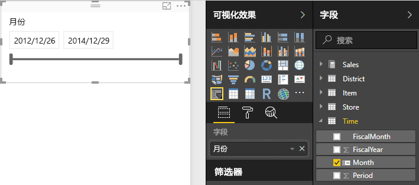

# Power BI 中的切片器
你希望报表读者能够查看总体销售指标，但同时突出显示各个地区经理和不同时间范围的业绩表现。 可以创建单独的报表或比较图表，也可以使用切片器。 切片器是另一种筛选方法，用于限制在报表的其他可视化效果中显示的部分数据集。 

本教程通过免费的[零售分析示例](sample-retail-analysis.md)，演示如何创建、格式化以及使用列表及日期范围切片器。 通过有趣的新方法使用切片器并进行格式化。 

## 何时使用切片器
在要完成以下操作时，切片器非常有用：

* 在报表画布上显示常用或重要的筛选器，用以简化访问。
* 更轻松地查看当前筛选的状态，而无需打开下拉列表。 
* 按数据表中不需要的和隐藏的列进行筛选。
* 通过将切片器放置在重要的视觉对象旁边来创建更多报表。

Power BI 切片器存在以下限制：

- 切片器不支持输入字段。
- 切片器不能固定到仪表板。
- 切片器不支持明细。
- 切片器不支持视觉对象级别的筛选器。

## 创建切片器

若要创建新的切片器，可以选择切片器图标，然后选择要筛选的数据字段（或将其拖到“可视化效果”窗格的“字段”框中），也可以首先选择或拖动数据字段来创建可视化效果，然后选择切片器图标将可视化效果转换为切片器。 不同数据类型创建不同类型的切片器，并带有不同的效果和选项。 

**创建新的切片器来按地区经理筛选数据**

1. 在 Power BI Desktop 或 Power BI 服务中，打开[零售分析示例](sample-retail-analysis.md)。 （在 Power BI 服务中，选择左上方的“编辑报表”。）
2. 在“概述”页上，画布上不选中任何内容，选择“可视化效果”窗格中的“切片器”图标来创建新的切片器。 
3. 在选择新切片器后，选择“字段”窗格中“地区”下的“地区经理”来填充切片器。 新切片器是一个在名称前有选择框的列表。 
    
    
    
4. 调整大小并将切片器和其他元素拖至画布，以便为切片器腾出空间。 请注意，如果切片器的大小调整得过小，切片器项将被截断。 
5. 选择切片器上的名称，并注意对页面上其他可视化效果的影响。 再次选中名称以取消选择，并按住 Ctrl 键选择多个名称。 选择所有名称与不选择任何名称的效果相同。 

>[!TIP]
>默认情况下，列表切片器项以字母数字升序的方式进行排序。 若要按反向降序顺序进行排序，请选择切片器右上角的省略号 (...)，然后选择下拉列表中的“按区域经理进行排序”。 

**创建新的切片器以按日期范围筛选数据**

1. 画布上不选中任何内容，下拉“字段”窗格中的“时间”列表，并将“月”（或 Power BI 服务中的“日期”）拖至“可视化效果”窗格中的“值”框中，以创建新的可视化效果。
2. 选择新的可视化效果后，选择“切片器”图标，将新的可视化效果转换为切片器。 此切片器是填充有日期范围的滑块控件。
    
    
    
4. 调整大小并将切片器和其他元素拖至画布，以便为切片器腾出空间。 请注意，滑块大小根据切片器大小进行调整，但如果切片器大小调整得过小，它将消失且日期会被截断。 
4. 在滑块中选择不同的日期范围，或选择“日期”字段以键入值，或弹出日历以便更精确地进行选择。 请注意对页面上其他可视化效果的影响。
    
    >[!NOTE]
    >默认情况下，数值和日期/时间数据类型会生成范围滑块切片器。 从 2018 年 2 月 Power BI 更新开始，整数数据类型范围滑块现对齐到整数值，而不是显示小数位。 

>[!TIP]
>尽管“月”数据字段默认生成“之间”范围滑块切片器类型，你仍可以将其更改为其他切片器类型和选择选项。 若要更改切片器类型，请在选择切片器后，将鼠标悬停在切片器的右上方区域，下拉显示的脱字号列表，然后选择其他选项之一，如“列表”或“之前”。 请注意切片器的外观和选择选项如何变化。 

若要深入了解如何创建日期和数值范围切片器，请观看以下视频或参阅[在 Power BI Desktop 中使用数值范围切片器](desktop-slicer-numeric-range.md)。
<iframe width="560" height="315" src="https://www.youtube.com/embed/zIZPA0UrJyA" frameborder="0" allowfullscreen></iframe> 

## 控制受切片器影响的页面视觉对象
默认情况下，报表页上的切片器会影响该页上的所有其他可视化效果，而且还会相互影响。 在刚创建的列表和日期滑块中选择值时，请注意对其他可视化效果的影响。 筛选后的数据是这两个切片器中所选值的交集。 

可以使用“视觉对象交互”来排除某些页面的可视觉化效果，以免受到其他可视化效果的影响。 在“概述”页上，“按财月和地区经理排列的总销售额方差”图表显示针对地区经理的按月总体比较数据，你希望此数据在任何时候都保持可见。 可以使用“视觉对象交互”来阻止切片器选择筛选此图表。 

1. 选择地区经理切片器的情况下：
    - 在 Power BI Desktop 中，选择“可视化工具”下的“格式”菜单并选择“编辑交互”。
    - 在 Power BI 服务中，沿着菜单栏向下浏览“视觉对象交互”下拉列表，并启用“编辑交互”。 
   
   页面上所有其他视觉对象上方随即显示筛选器控件。 最初，所有“筛选器”图标都将被选中。
   
2. 选择“按财月和地区经理排列的总销售额方差”图表上的“无”图标，以停止切片器对其进行筛选。 
3. 选择“月”切片器，然后再次选择“按财月和地区经理排列的总销售额方差”图表上的“无”图标，以停止此切片器对其进行筛选。 现在，当你在切片器中选择名称和日期范围时，“按财月和地区经理排列的总销售额方差”图表将保持不变。 

有关编辑交互的详细信息，请参阅 [Power BI 报表中的视觉对象交互](service-reports-visual-interactions.md)。

## 同步切片器并在其他页面上使用
自 Power BI 2018 年 2 月更新起，可同步切片器并在报表的任意页面上使用。 

在当前报表中，“地区每月销售”页还提供“地区经理”切片器，但它不会与在“概述”上创建的切片器同步（这两个切片器可以有不同的项选择）。 “新商店”页只有“商店名称”切片器。 可以在这些页面上同步新“地区经理”切片器，以便任何页上的切片器选择会影响所有三个页面上的可视化效果。 

1. 在 Power BI Desktop 中的“视图”菜单上 选择“同步切片器”（或在 Power BI 服务中启用“同步切片器”窗格）。 随即显示“同步切片器”窗格。 
2. 在“概述”页上，选择“地区经理”切片器。 请注意，已经在“可见”列中选择“地区每月销售”页，因为在该页上还有地区经理切片器，但未在“同步”列中选中。 
    
    
    
3. 在“同步”列中，选择“新商店”页和“地区每月销售”页，以在这些页面上同步“概述”切片器。 
    
3. 在“可见”列中，选择“新商店”页，并使“地区每月销售”页保持选中状态。 
4. 观察同步切片器并使其在其他页上可见的影响。 在“地区每月销售”页上，“地区经理”切片器现显示与“概述”页上的切片器相同的选择。 在“新商店”页上，选择“地区经理”切片器会影响可在“商店名称”切片器中使用的选择。 
    
    >[!TIP]
    >尽管切片器最初以与原始页面相同大小和相同位置的方式出现在同步页面上，但你可以在不同页面上独立移动、调整大小和格式化同步切片器。 

>[!NOTE]
>如果将切片器同步到一个页面，但不让它在该页上可见，那么在其他页面上所做的切片器选择仍然会筛选该页上的数据。
 
## 格式化切片器
可用的不同格式化选项具体取决于切片器类型。 通过使用“水平”方向、“响应式”布局，和“项”着色，可以生成按钮或磁贴，而不是标准列表项，并使切片器项调整大小以适应不同的屏幕大小和布局。  

1. 在任何页面上选择“区域经理”切片器后，在“可视化效果”窗格中选择“格式”图标  以显示格式化控件。 
    
    
    
2. 选择每个类别旁边的下拉列表箭头，显示和编辑选项。 

### 常规选项
1. 选择“边框颜色”中的红色，并将“边框粗细”更改为“2”。 启用时，将设置标头和项目外虚线框或实线框的颜色/粗细。 
2. 在“方向”下，“垂直”是默认设置。 选择“水平”可以生成带水平排列磁贴或按钮的切片器，并滚动箭头访问切片器中不适合的项。
    
    
    
3. 启用“响应式”布局切片器，根据屏幕和切片器大小更改切片器项的大小和排列方式。 对于列表切片器，响应式布局仅适用于水平方向，可防止项在小屏幕上截断。 对于范围滑块切片器，响应式格式设置更改滑块样式，并且可以更灵活地调整大小。 这两种类型的切片器都变成了非常小的筛选器图标。 
    
    
    
    >[!NOTE]
    >更改响应式布局后，可能会覆盖所设置的特定标题和项格式。 
    
4. 在“X 位置”、“Y 位置”、“宽度”和“高度”中使用数值精度设置切片器位置和大小，或者直接在画布上移动切片器或调整其大小。 尝试不同的项大小和布局，并注意响应式格式设置如何相应地更改。  

    

若要深入了解水平方向和响应式布局，请参阅[在 Power BI 中创建可调整大小的响应式切片器](power-bi-slicer-filter-responsive.md)。

### 选择控件选项（仅列表切片器）
1. 默认关闭“显示全选”。 将其打开，将“选择所有项”添加到切片器，使其在切换时可选择或取消选择所有项。 在选择所有项后，单击或点击一个项以取消选择，允许“is-not”类型筛选器。 
    
    
    
2. 默认启用“单项选择”。 单击或点击每个项即将其选中，按住 Ctrl 键并同时单击或点击多个项可选择多个项。 关闭“单项选择”后，无需按 Ctrl 即可选择多个项。 再次单击或点击每个项即取消选择。 

### 标头选项
“标头”默认开启，它可在切片器顶部显示数据字段名称。 
1. 设置标头文本格式：将字体颜色设为红色、文本大小为为 14 pt、字体系列为 Arial Black。 
2. 在“边框”中，选择“仅下框线”，生成带有在“常规”选项下设置的大小和颜色的下框线。 

### 项选项（仅列表切片器）
1. 设置项文本和背景的格式：字体颜色设为黑色、背景为浅红色、文本大小为为 10 pt、字体系列为 Arial。 
2. 在“边框”中，选择“框架”，在每个项周围添加带有在“常规”选项下设置的大小和颜色的边框线。 
    
    
    
    >[!TIP]
    >- 设置为“方向”>“水平”时，取消选择的项显示已选文本和背景颜色，而所选项使用系统默认设置，通常是黑色背景和白色文本。
    >- 设置为“方向”>“垂直”时，项始终显示设置的颜色，选择项时选择框始终为黑色。 

### 日期/数值输入和滑块选项（仅范围滑块切片器）
- “日期/数值输入”选项与列表切片器的“项”选项相同，但没有任何“边框”或下框线。
- 滑块选项允许你设置范围滑块的颜色，或关闭滑块，仅保留数值输入。

### 其他格式设置选项
其他格式设置选项默认关闭。 当启用时： 
- **标题：** 在切片器顶部添加标题并设置其格式（附加在标头上且与标头无关）。 
- **背景：** 将背景颜色添加到整个切片器并设置其透明度。
- **锁定纵横比：** 重新调整大小后，切片器的形状保持不变。
- **边框：** 在切片器周围添加 1 像素的边框并设置其颜色。 （此切片器边框是单独的，不受常规边框设置影响。） 

## 后续步骤
[试用一下 - 完全免费！](https://powerbi.com/)

你有关于如何改进 Power BI 的想法吗？ [提交想法](https://ideas.powerbi.com/forums/265200-power-bi-ideas)。

更多问题？ [尝试参与 Power BI 社区](http://community.powerbi.com/)

[向报表添加可视化效果](power-bi-report-add-visualizations-i.md)

[Power BI 中的可视化效果类型](power-bi-visualization-types-for-reports-and-q-and-a.md)

[Power BI - 基本概念](service-basic-concepts.md)

