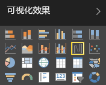
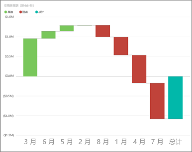
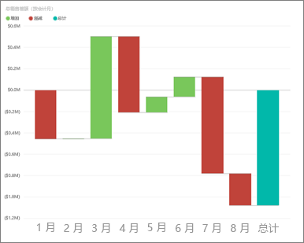
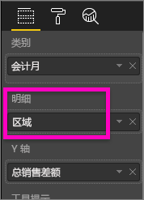
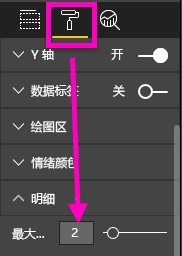
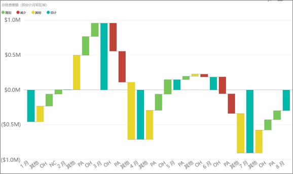

# Power BI 中的瀑布图
瀑布图显示随着值的增加或减少的不断变化的总数。 该图对于了解一系列正值和负值更改如何影响初始值（例如，净收益）很有用。

列使用颜色编码，因此可以快速区分增加和减少。 初始值列和最终值列通常[从水平轴开始](https://support.office.com/article/Create-a-waterfall-chart-in-Office-2016-for-Windows-8de1ece4-ff21-4d37-acd7-546f5527f185#BKMK_Float "从水平轴开始")，而中间值为浮动列。 由于该图的外观，瀑布图也被称为桥图。

<iframe width="560" height="315" src="https://www.youtube.com/embed/qKRZPBnaUXM" frameborder="0" allow="autoplay; encrypted-media" allowfullscreen></iframe>

## 何时使用瀑布图
瀑布图适用情况：

* 跨时序或不同类别更改指标
* 要审核对总值有影响的主要更改
* 要通过显示各种收入来源和计算总利润（或损失）绘制公司的的年利润图。
* 要说明一年中公司的起始和结束员工人数。
* 要可视化你每月的收入和支出，以及你的帐户的不断变化的余额。 

## 创建瀑布图
我们将创建按月显示销售差额（比较估计销售额与实际销售额）的瀑布图。 要遵循示例执行操作，请登录到 Power BI，然后选择**获取数据 \> 示例 \> 零售分析示例** 。 

1. 选择“数据集”选项卡并滚动到新的“零售分析示例”数据集。  选择“创建报表”图标，在报表编辑视图中打开数据集。 
   
    
2. 从**字段**窗格，选择**销售额 \> 总销售差额**。 如果**总销售差额**不在 **Y 轴**区域中，请将其拖至该区域。
3. 将图表转换为**瀑布图**。 
   
    
4. 选择**时间** \> **财月**以将它添加到**类别**框。 
   
    
5. 按时间顺序对瀑布图排序。 在图表右上角选择省略号 (...)，然后选择“财月”。
   
    
   
    
6. 进一步了解每月发生变化的最主要原因。 将“应用商店” > “区域”拖动到“细目”桶中。
   
    
7. 默认情况下，Power BI 按月将前 5 个地区添加到增加结果或减少结果中。 但我们只关注前 2 个地区。  在“格式设置”窗格中，选择“细目”，并将“最大值”设置为 2。
   
    
   
    快速浏览显示，在我们的瀑布图中，俄亥俄州和宾夕法尼亚州是正负增长变化幅度最大的两个区域。 
   
    
8. 这个结果很有意思。 俄亥俄州和宾夕法尼亚州具有如此显著的影响，是不是因为这两个区域的销售额远高于其他区域？  我们可以来看看。 创建一个按区域显示销售额的地图。  
   
    
   
    地图验证了我们的结果。  地图显示，这两个区域具有去年（气泡大小）和今年（气泡明暗度）的销售额最高值。

## 突出显示和交叉筛选
有关使用筛选器窗格的信息，请参阅[向报表添加筛选器](power-bi-report-add-filter.md)。

突出显示瀑布图中的列可交叉筛选报表页上的其他可视化效果，反之亦然。 但是，“汇总”列不会触发突出显示或响应交叉筛选。

## 后续步骤
[Power BI 中的报表](service-reports.md)

[Power BI 中的可视化效果类型](power-bi-visualization-types-for-reports-and-q-and-a.md)

[Power BI 报表中的可视化效果](power-bi-report-visualizations.md)

[Power BI - 基本概念](service-basic-concepts.md)

更多问题？ [尝试参与 Power BI 社区](http://community.powerbi.com/)

