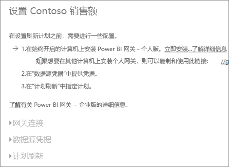
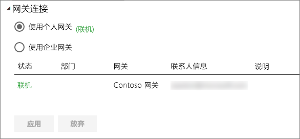
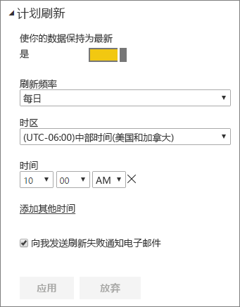

# 配置计划刷新

>[!NOTE]
>非活动状态持续两个月后，你的数据集上的计划刷新会暂停。 有关详细信息，请参阅本文后面的[*计划刷新*](#schedule-refresh)部分。
> 
> 

如果你的数据集支持使用“立即刷新”和“计划刷新”进行计划刷新，要想刷新成功，有几个要求和设置非常重要。 这些设置包括“网关连接”、“数据源凭据”和“计划刷新”。 让我们仔细了解下每个设置。

这将描述同时可用于 [Power BI Gateway – Personal](personal-gateway.md) 和[本地数据网关](service-gateway-onprem.md)的选项。

若要进入计划刷新屏幕，你可以执行以下操作。

1. 选择“数据集”下所列的某个数据集旁边的“省略号 (...)”。
2. 选择“计划刷新”。
   
    

## 网关连接
根据你拥有联机可用的个人网关还是企业网关，将会看到不同的选项。

如果没有网关可用，你将看到“网关设置”处于禁用状态。 你还将看到一条消息，指出如何安装个人网关。

如果已配置个人网关且处于联机状态，将可以选择该网关。 如果不可用，它将显示脱机。

你还可以选择企业网关（如果有）。 如果在针对给定网关配置的数据源的“用户”选项卡中列出你的帐户，则你将只会看到企业网关可用。

## 数据源凭据
### Power BI Gateway - Personal
如果使用个人网关来刷新数据，你将需要提供用来连接到后端数据源的凭据。 如果你已从一项联机服务连接到内容包，将会为计划刷新保留你输入用于连接的凭据。

仅当首次在该数据集上使用刷新时，才要求你登录数据源。 输入后，这些凭据将随数据集一起保留。

> [!NOTE]
> 对于部分身份验证方法，如果用于登录数据源的密码已到期或已被更改，则必须也要更改数据源凭据中的数据源密码。
> 
> 

出现故障时，问题通常与网关处于脱机状态（因为其无法登录 Windows 并启动服务）有关，或与 Power BI 无法登录数据源以便查询更新数据有关。 如果刷新失败，请检查数据集的设置。 如果网关服务处于脱机状态，你将从网关状态中看到错误。 如果 Power BI 无法登录数据源，你将收到数据源凭据错误。

### 本地数据网关
如果使用本地数据网关来刷新数据，将不需要提供凭据，因为凭据是网关管理员为数据源定义的。

> [!NOTE]
> 连接到本地 SharePoint 进行数据刷新时，Power BI 仅支持匿名、基本和 Windows (NTLM/Kerberos) 身份验证机制。 对于本地 SharePoint 数据源的数据刷新，Power BI 不支持 *ADFS* 或任何基于表单的身份验证机制。
> 
> 

## 计划刷新
可在计划刷新部分定义刷新数据集的频率和时间插槽。 某些数据源不需要提供网关用于配置。 其他则需要网关。

必须将“使你的数据保持为最新”滑块设为“是”，才能配置设置。

> [!NOTE]
> Power BI 服务确定在你计划的刷新时间的 15 分钟内启动数据刷新。
> 
> 

> [!NOTE]
> 非活动状态持续两个月后，你的数据集上的计划刷新会暂停。 在没有用户访问基于数据集构建的任何仪表板或报表时，将数据集视为不活动。 此时，数据集所有者将收到一封电子邮件，指示计划刷新已暂停，并且数据集的刷新计划显示为**禁用**。 要恢复计划刷新，只需重新访问基于数据集构建的任何仪表板或报表。
> 
> 

## 支持的功能有哪些？
对于计划刷新的不同网关，支持某些特定数据集。 下面是用来了解可用内容的参考。

### Power BI Gateway - Personal
**Power BI Desktop**

* Power BI Desktop“获取数据”和“查询编辑器”中显示的所有联机数据源。
* Power BI Desktop“获取数据”和“查询编辑器”中显示的所有本地数据源，Hadoop 文件 (HDFS) 和 Microsoft Exchange 除外。

**Excel**

> [!NOTE]
> 在 Excel 2016 及更高版本中，Power Query 目前位于功能区的数据区域中，在“获取和转换数据”之下。
> 
> 

* Power Query 中显示的所有联机数据源。
* Power Query 中显示的所有本地数据源，Hadoop 文件 (HDFS) 和 Microsoft Exchange 除外。
* Power Pivot 中显示的所有联机数据源。\*
* Power Pivot 中显示的所有本地数据源，Hadoop 文件 (HDFS) 和 Microsoft Exchange 除外。

<!-- Refresh Data sources-->
[!INCLUDE [refresh-datasources](./includes/refresh-datasources.md)]

## 故障排除
有时可能不会按预期方式刷新数据。 通常，这会是与网关连接出现的问题。 请查看网关故障排除文章，了解相关工具和已知问题。

[本地数据网关故障排除](service-gateway-onprem-tshoot.md)

[Power BI Gateway - Personal 故障排除](service-admin-troubleshooting-power-bi-personal-gateway.md)

## 后续步骤
[Power BI 中的数据刷新](refresh-data.md)  
[Power BI Gateway - Personal](personal-gateway.md)  
[本地数据网关](service-gateway-onprem.md)  
[本地数据网关故障排除](service-gateway-onprem-tshoot.md)  
[Power BI Gateway - Personal 故障排除](service-admin-troubleshooting-power-bi-personal-gateway.md)  

更多问题？ [尝试咨询 Power BI 社区](http://community.powerbi.com/)

