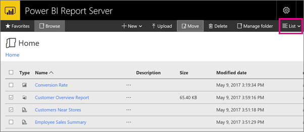

# 教程：浏览 VM 中的 Power BI 报表服务器 Web 门户
在本教程中，使用已安装的 Power BI 报表服务器创建 Azure 虚拟机，以便可以查看、编辑和管理示例 Power BI、分页报表和 KPI。

以下是将在本教程中执行的任务：

> [!div class="checklist"]
> * 创建并连接到 VM
> * 启动并浏览 Power BI 报表服务器 Web 门户
> * 标记收藏夹项
> * 查看和编辑 Power BI 报表
> * 查看、管理和编辑分页报表
> * 在 Excel Online 中查看 Excel 工作簿

对于本教程，你需要 Azure 订阅。 如果没有，请在开始之前先创建一个[免费帐户](https://azure.microsoft.com/free/?WT.mc_id=A261C142F)。

## 创建 Power BI 报表服务器 VM

幸运的是，Power BI 团队已创建已安装的 Power BI 报表服务器附带的 VM。

1. 在 Azure Marketplace 中，打开 [Power BI 报表服务器](https://azuremarketplace.microsoft.com/marketplace/apps/reportingservices.technical-preview?tab=Overview)。  

2. 选择“立即获取”。
3. 若要同意提供商的使用条款和隐私策略，请选择“继续”。

    

4. 步骤 1 基本信息，对于 VM 名称，称之为 reportservervm。

5. 创建用户名和密码。

6. 对于资源组，保留“新建”，并称之为 **reportserverresourcegroup**。

7. 保留其他默认值 >“确定”。

    

8. 步骤 2 设置，保留默认值 >“确定”。

9. 步骤 3 摘要 > “确定”。

10. 步骤 4，查看用户条款和隐私策略 >“创建”。

    **提交 Power BI 报表服务器的部署**过程需要几分钟时间。

## 连接到虚拟机

1. 在 Azure 的左侧导航窗格中，选择“虚拟机”。 

2. 在“按名称筛选”框中，键入“报表”。 

3. 选择名为 **REPORTSERVERVM** 的 VM。

    

4. 在 REPORTSERVERVM 虚拟机下，选择“连接”。

    

5. 在“远程桌面连接”对话框中，选择“连接”。

6. 输入为 VM 创建的名称和密码 >“确定”。

7. 下一个对话框中显示无法识别远程计算机的标识。 选择“是”。

   Voila -- 将打开新的 VM。

## VM 中的 Power BI 报表服务器

打开 VM 后，以下是桌面上看到的项目。

|数字  |项目内容  |
|---------|---------|
| | 启动 SQL Server Data Tools，用于创建分页 (.RDL) 报表 |
| | 抽样 Power BI (.PBIX) 报表  |
| | 链接到 Power BI 报表服务器文档   |
| | 启动更适合 Power BI 报表服务器的 Power BI Desktop（2018 年 3 月）  |
| | 在浏览器中打开 Power BI 报表服务器 Web 门户   |

双击“报表服务器 Web 门户”图标。 浏览器将打开 http://localhost/reports/browse。 在 Web 门户中，将看到按类型分组的各种文件。 

|数字  |项目内容  |
|---------|---------|
| | Web 门户中创建的 KPI |
| |  Power BI (.PBIX) 报表  |
| | SQL Server 移动报表发布服务器中创建的移动报表  |
| |  报表生成器或 SQL Server Data Tools 中创建的分页报表  |
| | Excel 工作簿   | 
| | 分页报表的数据源 | 

## 标记收藏夹
可以标记要收藏的报表和 KPI。 这样方便你快速找到，因为在 Web 门户和 Power BI 移动应用中，它们全都会被收集到一个“收藏夹”文件夹中。 

1. 依次选择**利润率** KPI 右上角的省略号 (**…**) 和“添加到收藏夹”。
   
    
2. 在 Web 门户功能区上选择“**收藏夹**”，以在 Web 门户的“收藏夹”页上查看该收藏和其他收藏。
   
    

3. 选择“浏览”以返回到 Web 门户。
   
## 查看列表视图中的项目
默认情况下，Web 门户在磁贴视图中显示其内容。

可以切换到列表视图，以便可以轻松地一次移动或删除多个项目。 

1. 依次选择“磁贴” > “列表”。
   
    

2. 返回到磁贴视图：选择“列表” > “磁贴”。

## Power BI 报表

可以查看 Web 门户中的 Power BI 报表并与之进行交互，还可以直接从 Web 门户启动 Power BI Desktop。

### 查看 Power BI 报表

1. 在 Web 门户的“Power BI 报表”下，选择“示例客户概述报表”。 随即在浏览器中打开报表。

1. 选择树形图中的美国块以查看如何突出显示其他视觉对象中的相关值。

    

### 在 Power BI Desktop 中编辑

1. 选择“在 Power BI Desktop 中编辑”。

1. 选择“允许”以允许此网站打开计算机上的程序。 

     随即在 Power BI Desktop 中打开报表。 请记住上栏中的名称，“Power BI Desktop（2018 年 3 月）”。 这是更适合 Power BI 报表服务器的版本。

    

3. 在“字段”窗格中，展开“客户”表并将“职业”字段拖动到报表级别筛选器。

    

1. 保存报表。

1. 返回到浏览器中的报表，然后选择浏览器“刷新”图标。

    

8. 展开右侧的“筛选器”窗格以查看已添加的“职业”筛选器。 选择“专业人员”。

    

3. 选择“浏览”以返回到 Web 门户。

## 分页 (.RDL) 报表

可以查看和管理分页报表，还可以从 Web 门户启动报表生成器。

### 管理分页报表

1. 在 Web 门户的“分页报表”下，选择“销售订单” > “管理”旁边的省略号 (...)。

1. 选择“参数”，将 SalesOrderNumber 的默认值更改为 SO50689 > “应用”。

   

3. 选择“浏览”以返回到 Web 门户。

### 查看分页报表

1. 在 Web 门户中选择“销售订单”。
 
3.  将看到打开已设置的“订单”参数 **SO50689** 的报表。 

    

    可以在此处更改该参数以及其他参数，而无需更改默认值。

1. 选择“订单 SO48339” > “查看报表”。

4. 将看到这是“第 1 页，共 2 页”。 选择右箭头以查看第二页。 表继续在该页上显示。

    

5. 选择“浏览”以返回到 Web 门户。

### 编辑分页报表

可以在报表生成器中编辑分页报表，还可以直接从浏览器启动报表生成器。

1. 在 Web 门户中，选择“销售订单” > “在报表生成器中编辑”旁边的省略号 (...)。

1. 选择“允许”以允许此网站打开计算机上的程序。

1. “销售订单”报表将在报表生成器的设计视图中打开。

    

1. 选择“运行”以预览报表。

    

5. 关闭报表生成器，然后返回到浏览器。

## 查看 Excel 工作簿

可以在 Power BI 报表服务器的 Excel Online 中查看 Excel 工作簿并与之进行交互。 

1. 选择 Excel 工作簿“Office Liquidation Sale.xlsx”。 可能会要求输入凭据。 选择“取消”。 
    随即在 Web 门户中打开。
1. 在切片器中选择“设备”。

    

1. 选择“浏览”以返回到 Web 门户。

## 清理资源

现已完成本教程，可以删除资源组、虚拟机及相关的所有资源。 

- 为此，请选择 VM 的资源组，然后选择“删除”。

## 后续步骤

在本教程中，已使用 Power BI 报表服务器创建 VM。 已尝试过 Web 门户的一些功能，并且已在各自的编辑器中打开 Power BI 报表和分页报表。 若要了解有关为 Power BI 报表服务器创建报表的详细信息，请继续操作。

> [!div class="nextstepaction"]
> [为 Power BI 报表服务器创建 Power BI 报表](./quickstart-create-powerbi-report.md)

