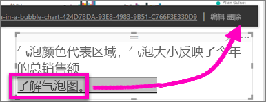

# 向报表中的文本框添加超链接
可以将文本框添加到报表，从报表固定到仪表板，然后直接添加到仪表板。 可将超链接添加到任意位置的文本框。  

> **注意**：有关 Power BI 表和矩形图中的超链接的相关信息，请参阅[表中的超链接](power-bi-hyperlinks-in-tables.md)。 有关将文本框添加到**仪表板**的信息，请参阅[直接从仪表板添加磁贴](service-dashboard-add-widget.md)。 
> 
> 

<iframe width="560" height="315" src="https://www.youtube.com/embed/_3q6VEBhGew#t=0m55s" frameborder="0" allowfullscreen></iframe>

## 向报表中的文本框添加超链接
1. [创建文本框并添加一些文本](power-bi-reports-add-text-and-shapes.md)。 
2. 突出显示现有文本，或添加新文本以用作超链接。
   
   
3. 选择超链接图标 。
4. 在超链接字段中键入或粘贴 URL，并选择**完成**。
   
   
5. 测试链接。  
   
   
   
   * 将光标置于突出显示的文本中的任何位置可显示 URL。  
     
      
   * 选择 URL 以便在新浏览器窗口中打开页面。

## 删除超链接但保留文本的步骤
1. 在文本框中，选择超链接以突出显示它，
   
     
2. 选择“删除”。 

## 后续步骤
[Power BI 报表中的文本框](power-bi-reports-add-text-and-shapes.md)

更多问题？ [尝试参与 Power BI 社区](http://community.powerbi.com/)

