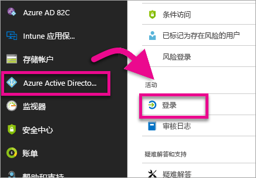
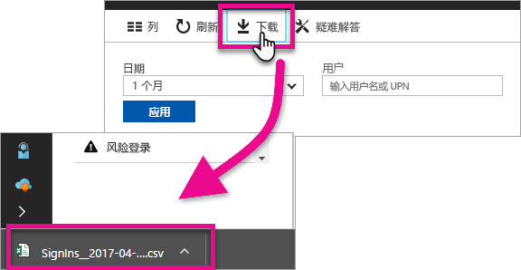

# 查找已登录的 Power BI 用户
如果你是租户管理员，想查看已登录 Power BI 的用户，则可以使用 Azure Active Directory 访问和使用情况报告进行查看。

<iframe width="640" height="360" src="https://www.youtube.com/embed/1AVgh9w9VM8?showinfo=0" frameborder="0" allowfullscreen></iframe>

可以访问 Azure Active Directory (Azure AD) [新](https://docs.microsoft.com/azure/active-directory/active-directory-reporting-activity-sign-ins)门户和[经典](https://docs.microsoft.com/azure/active-directory/active-directory-view-access-usage-reports)门户中的活动报告。 上面的视频使用经典门户作为示例，但本文将重点介绍新门户。

> [!NOTE]
> 此活动报告包括 Power BI（免费）和 Power BI Pro 用户，但不会按用户所拥有的许可证对他们进行标识。
> 
> 

## 要求
下面是查看登录活动报告的要求。

* 全局管理员、安全管理员或安全读者角色中的用户可以访问数据。
* 任何用户（非管理员）都可以访问自己的登录活动报告。
* 租户必须拥有与报告关联的 Azure AD Premium 许可证才能查看所有登录活动报告。

## 使用 Azure 门户查看登录活动
可使用 Azure AD 门户查看登录活动。

1. 浏览到 Azure 门户，选择“Azure Active Directory”。
2. 在“活动”下，选择“登录”。
   
    
3. 按“Microsoft Power BI”或“Power BI 网关”筛选应用程序，然后选择“应用”或。
   
    Microsoft Power BI 针对与服务相关的登录活动，而 Power BI 网关针对本地数据网关的登录。
   
    

## 导出数据
可通过两个选项导出登录数据。 即下载 csv 文件或使用 PowerShell。

### 下载 csv 文件
在“活动”屏幕中，选择工具栏中的“下载”。 此操作将下载当前筛选的数据的 csv 文件。

### PowerShell
可以使用 PowerShell 导出登录数据。 Azure AD 文档中提供了[示例](https://docs.microsoft.com/azure/active-directory/active-directory-reporting-api-sign-in-activity-samples#powershell-script)。

> [!NOTE]
> 为使 PowerShell 示例正常工作，请务必遵循[访问 Azure AD 报告 API 的先决条件](https://docs.microsoft.com/azure/active-directory/active-directory-reporting-api-prerequisites)。
> 
> 

## 数据保留期
登录相关数据最长可保留 30 天。 有关详细信息，请参阅 [Azure Active Directory 报告保留策略](https://docs.microsoft.com/azure/active-directory/active-directory-reporting-retention)。

## 后续步骤
[Azure Active Directory 门户中的“登录活动”报告（新门户）](https://docs.microsoft.com/azure/active-directory/active-directory-reporting-activity-sign-ins)  
[查看访问和使用情况报告（经典门户）](https://docs.microsoft.com/azure/active-directory/active-directory-view-access-usage-reports#view-or-download-a-report)  
[登录示例 PowerShell 脚本](https://docs.microsoft.com/azure/active-directory/active-directory-reporting-api-sign-in-activity-samples#powershell-script)  
[Azure Active Directory 报告保留策略](https://docs.microsoft.com/azure/active-directory/active-directory-reporting-retention)  
[在组织内使用审核](service-admin-auditing.md)  
[激活延长的 Power BI Pro 试用期](service-extended-pro-trial.md)

更多问题？ [尝试咨询 Power BI 社区](https://community.powerbi.com/)

