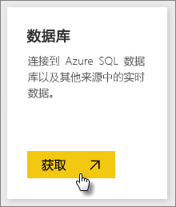
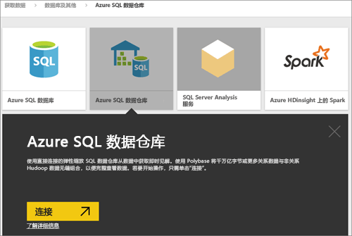
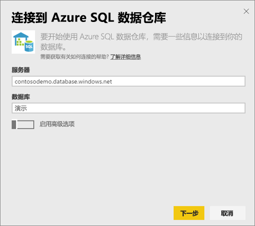
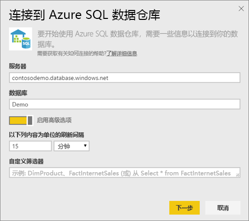
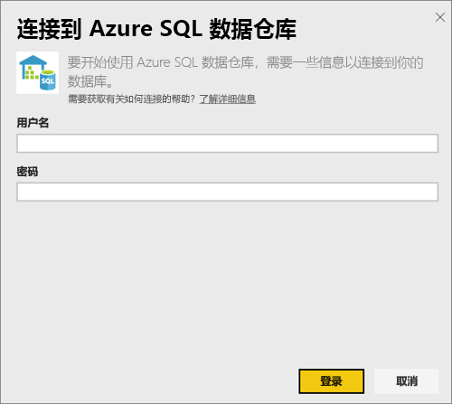
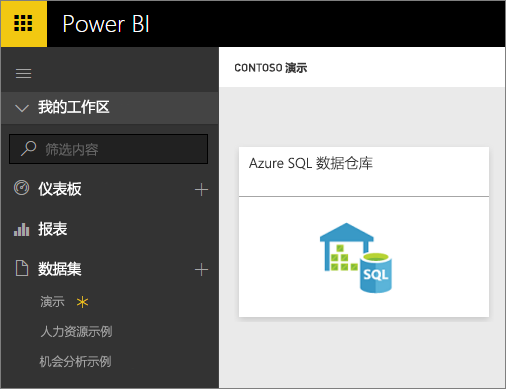
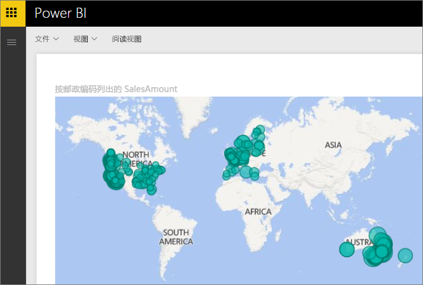
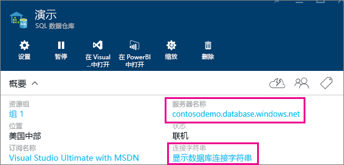

# 具有 DirectQuery 的 Azure SQL 数据仓库
通过具有 DirectQuery 的 Azure SQL 数据仓库可以基于在 Azure SQL 数据仓库中已具有的数据和指标来创建动态报表。 借助 DirectQuery，查询会在你浏览数据时实时发送回 Azure SQL 数据仓库。 这种情况与 SQL 数据仓库的规模相结合，使用户可以在数分钟内针对以 TB 计的数据创建动态报表。 此外，**在 Power BI 中打开**按钮的引入使用户可以直接将 Power BI 连接到其 SQL 数据仓库，而不必手动指定信息。

何时使用 SQL 数据仓库连接器：

* 在连接时指定完全限定的服务器名称（请参阅下文以了解详细信息）
* 确保服务器的防火墙规则配置为“允许访问 Azure 服务”
* 每个操作（例如选择列或添加筛选器）都会直接查询数据仓库
* 磁贴设置为大约每 15 分钟刷新一次，刷新不需要进行计划。  连接时可以在“高级设置”中对此进行调整。
* 问答不可用于 DirectQuery 数据集
* 不会自动选取架构更改

随着我们继续改进体验，这些限制和说明可能会发生变化。 下面详细介绍了用于连接的步骤。

## 使用“在 Power BI 中打开”按钮

> [!Important]
> 我们在不断改进与 Azure SQL 数据仓库的连接。  若要获取连接到 Azure SQL 数据仓库数据源的最佳体验，请使用 Power BI Desktop。  生成模型和报表后，即可将其发布到 Power BI 服务中。  Power BI 服务的 Azure SQL 数据仓库现已弃用直接连接器。
>

在 SQL 数据仓库与 Power BI 之间移动的最简单方法是使用 Azure 预览门户中的**在 Power BI 中打开**按钮。 通过此按钮可以无缝地开始在 Power BI 中创建新仪表板。

1. 若要开始，请在 Azure 预览版门户中导航到 SQL 数据仓库实例。 请注意，SQL 数据仓库当前只在 Azure 预览门户中存在。
2. 单击**在 Power BI 中打开**按钮
   
    
3. 如果我们无法直接使你登录，或者如果你没有 Power BI 帐户，则你需要登录。
4. 你会定向到 SQL 数据仓库连接页面（其中预填充了 SQL 数据仓库中的信息）。 输入凭据并点击连接以创建连接。

## 通过 Power BI 连接
SQL 数据仓库还在 Power BI 获取数据页面上列出。 

1. 在左侧导航窗格底部选择“获取数据”。  
   
    
2. 在**数据库**中，选择**获取**。
   
    
3. 选择**SQL 数据仓库** \> **连接**。
   
    
4. 输入所需信息进行连接。 下面的**查找参数**部分显示此数据 Azure 门户中可能所处的位置。
   
    
   
    
   
    
   
   > [!NOTE]
   > 用户名将是在你的 Azure SQL 数据仓库实例中定义的用户。
   > 
   > 
5. 通过选择新磁贴或新创建的数据集（由星号指示）来钻取到数据集中。 此数据集会具有与数据库相同的名称。
   
    
6. 你可以浏览所有表和列。 选择某列会将查询发送回源，从而动态创建视觉对象。 筛选器也会转换为返回到数据仓库的查询。 这些视觉对象可以保存在新报表中，并重新固定到仪表板。
   
    

## 查找参数值
可以在 Azure 预览门户中找到你的完全限定的服务器名称和数据库名称。 请注意，SQL 数据仓库当前只在 Azure 预览门户中存在。

> [!NOTE]
> 如果 Power BI 租户与 Azure SQL 数据仓库位于相同区域，则不会产生流出费用。 可按照[这些说明](https://docs.microsoft.com/power-bi/service-admin-where-is-my-tenant-located)查找 Power BI 租户的所在位置。
>

## 后续步骤
[什么是 Power BI？](power-bi-overview.md)  
[获取 Power BI 的数据](service-get-data.md)  
[Azure SQL 数据仓库](https://azure.microsoft.com/documentation/services/sql-data-warehouse/)  

更多问题？ [尝试参与 Power BI 社区](http://community.powerbi.com/)