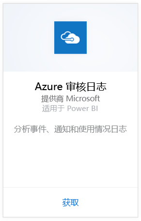
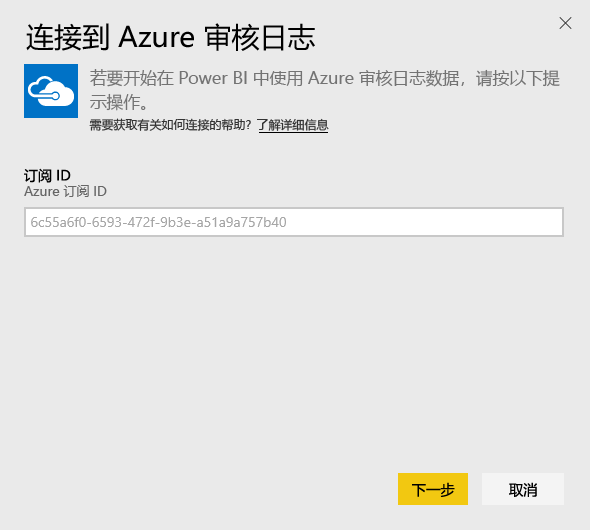
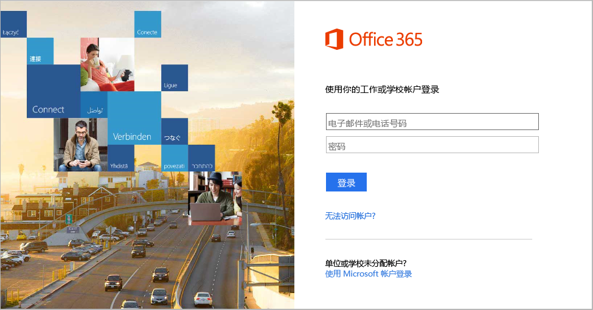
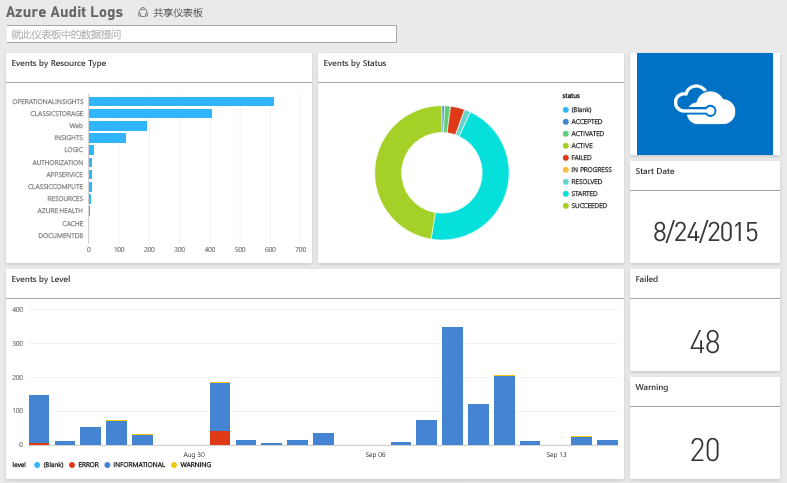

# 使用 Power BI 连接到 Azure 审核日志
借助 Azure 审核日志内容包，你可以分析和可视化审核日志中存储的信息。 Power BI 会检索数据，生成现成的仪表板，并基于该数据创建报表。

[连接到 Azure 审核日志内容包](https://app.powerbi.com/getdata/services/azure-audit-logs)，或阅读有关使用 Power BI 进行 [Azure 审核日志集成](https://powerbi.microsoft.com/integrations/azure-audit-logs)的详细信息。

## 如何连接
1. 选择左侧导航窗格底部的**获取数据**。  
   
    
2. 在**服务**框中，选择**获取**。  
   
     
3. 选择 **Azure 审核日志**  >  **获取**。  
   
   
4. 出现提示时，输入你的**Azure 订阅 ID**。 请参阅下面有关查找[订阅 ID](#FindingParams) 的详细信息。   
   
    
5. 对于**身份验证方法**，选择**oAuth2**\>**登录**。
   
    
6. 输入你的帐户凭据以完成登录过程。
   
    
7. Power BI 会检索 Azure 审核日志数据，并创建随时可用的仪表板和报表。 
   
    

**下一步？**

* 尝试在仪表板顶部的[在“问答”框中提问](power-bi-q-and-a.md)
* 在仪表板中[更改磁贴](service-dashboard-edit-tile.md)。
* [选择磁贴](service-dashboard-tiles.md)以打开基础报表。
* 虽然数据集将按计划每日刷新，你可以更改刷新计划或根据需要使用**立即刷新**来尝试刷新

## 系统要求
Azure 审核日志内容包需要可以在 Azure 门户中访问审核日志。 [此处](https://azure.microsoft.com/documentation/articles/insights-debugging-with-events/)提供了详细信息。

## 查找参数
可通过两种简单的方法来查找订阅 ID。

1. 从 https://portal.azure.com -&gt; 浏览 -&gt; 订阅 -&gt; 订阅 ID
2. 从 https://manage.windowsazure.com -&gt; 设置 -&gt; 订阅 ID

订阅 ID 会是一组较长的数字和字符，类似于上面步骤 \#4 中的示例。 

## 故障排除
如果你遇到凭据错误或是在尝试刷新时由于凭据无效而出现的错误，请尝试删除 Azure 审核日志内容包的所有实例并重新连接。

## 后续步骤
[Power BI 入门](service-get-started.md)  
[Power BI - 基本概念](service-basic-concepts.md)  

