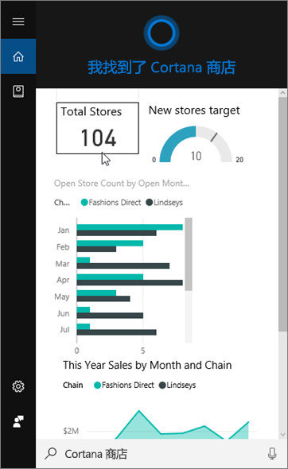
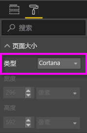
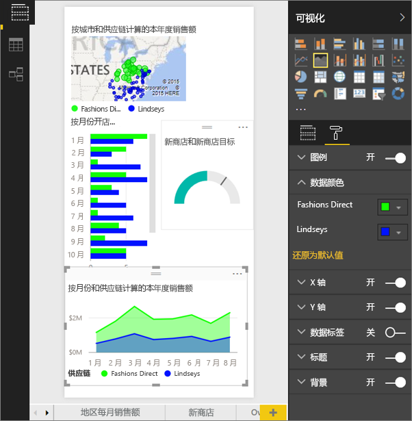
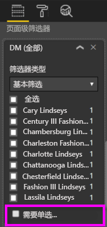

# 使用 Power BI 服务或 Power BI Desktop 为 Cortana 创建自定义回复页
使用 Power BI 的全部功能创建专为回答 Cortana 问题而设计的专用报表页，称为“Cortana 回复页”（有时称为“Cortana 回复卡”）。

> [!IMPORTANT]
> 如果你尝试预览 Cortana 和 Power BI 仪表板，则可以跳过本文的其余部分。 无需对 Cortana 进行任何设置即可搜索 Power BI 仪表板。
> 
> 

## 开始之前
提供 4 个文档指导你完成设置和使用用于 Power BI 的 Cortana。 如果尚未这样做，建议你首先阅读文章 1。 文章 2 尤其重要，因为它说明了在你开始使用 Cortana 回复页之前需要执行的一些步骤。

**文章 1**：[了解 Cortana 和 Power BI 如何协同工作](service-cortana-intro.md)

**文章 2**：[对于搜索 Power BI 报表：启用 Cortana - Power BI - Windows 集成](service-cortana-enable.md)

**文章 3**：本文

**文章 4**：[解决问题](service-cortana-troubleshoot.md)

## 创建专为 Cortana 设计的 Cortana 回复页
报表中的 Cortana 回复页的大小专为 Cortana 而设，以便 Cortana 可以在屏幕中将其显示为某个问题的答案。 为 Cortana 创建回复页：

1. 我们建议从[空白报表页](power-bi-report-add-page.md)开始。
2. 在“可视化效果”窗格中，选择滚动油漆刷图标，然后选择“页面大小” > “类型” > “Cortana”。
   
    
3. 创建一个或一组想要在 Cortana 中显示的视觉对象，以用于响应特定问题（或多个问题）。

> [!NOTE]
> 目前，Cortana 回复页不支持其中显示有静态图像的图像。 根据数据中的 URL 动态提取的表格或矩阵视觉对象中可包含图像。 
> 
> 

4. 确保所有视觉对象都能放在页边框内。 可选择性地修改显示设置、数据标签、颜色和背景。  
   
    
5. 命名该页面并添加替代名称。 Cortana 在搜索结果时将使用这些名称。 在**可视化效果**窗格中，选择画笔图标，然后选择**页面信息**。 通过移动滑块至“开”，启用此视觉对象的问答。
   
    
   
   > [!TIP]
   > 若要改进结果，应避免使用还是列名称的词汇。
   > 
   > 
6. 如果报表有页面级别筛选器，可选择性地设置“需要单选”。 如果问题中只指定了一个，唯一一个筛选器项，则 Cortana 仅会将此报表显示为答案。 可以在“筛选器”窗格的底部找到“需要单选”。
   
   > [!NOTE]
   > 无需设置“需要单选”即可要求 Cortana 显示带有页面级筛选器的报表。 例如，无论“需要单选”设置如何，说出“显示 Charlotte Lindseys 的销售额”都可以显示答案页。
   > 
   > 
   
     
   
      例如，如果你问 Cortana：
   
   * “按零售店名称显示销售额”，此回复页不会显示，因为你未在所需的页面级别筛选器中包含任何项。
   * “显示 Cary Lindseys 和 Charlotte Lindseys 的销售额”，此回复页不会显示，因为你从所需的页面级别筛选器中指定了多个项。
   * “显示 Charlotte Lindseys 的销售额”，此回复页将显示。
     
     “显示销售额”，此回复页不会显示，因为你未在所需的页面级别筛选器中包含任何项。

> [!IMPORTANT]
> 在 Cortana 可访问 Cortana 回复页之前，需要[启用 Cortana 数据集](service-cortana-enable.md)。
> 
> 

## Cortana 如何对结果进行排序？
具有高分答案的结果（如指定页面名称的完全匹配项）将在 Cortana 中作为最佳匹配项第一个显示。 如果 Power BI 中有多个 Cortana 回复页，则可能显示多个最佳匹配项。 中等或较低评分的答案（例如不基于回复页名称的答案或具有 Power BI 无法理解的字词的问题）将在 Cortana 的最佳匹配项的下面作为链接列出。

> [!NOTE]
> 将新的数据集或自定义 Cortana 回复页添加到 Power BI 并为 Cortana 启用时，可能需要 30 分钟，结果才会开始出现于 Cortana 中。 登录或退出 Windows 10 或者在 Windows 10 中重启 Cortana 进程都能使新内容立刻显示。
> 
> 

## 后续步骤
[将 Cortana 和 Power BI 搭配使用](service-cortana-intro.md)

仍无法让 Cortana 与 Power BI 协同工作？  请尝试查阅 [Cortana 疑难解答](service-cortana-troubleshoot.md)。

更多问题？ [尝试参与 Power BI 社区](http://community.powerbi.com/)

