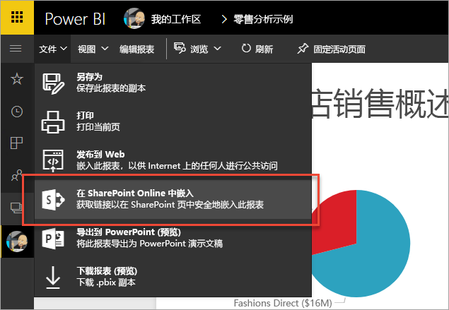
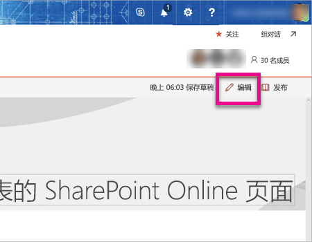
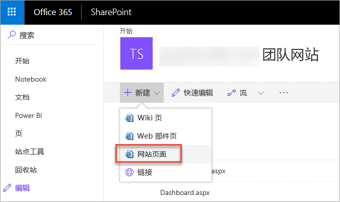
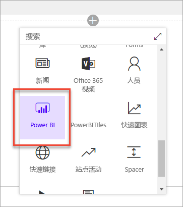
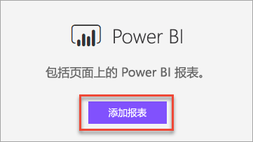
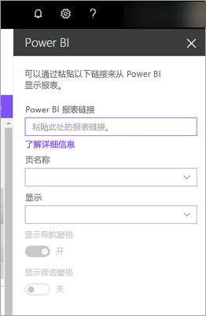
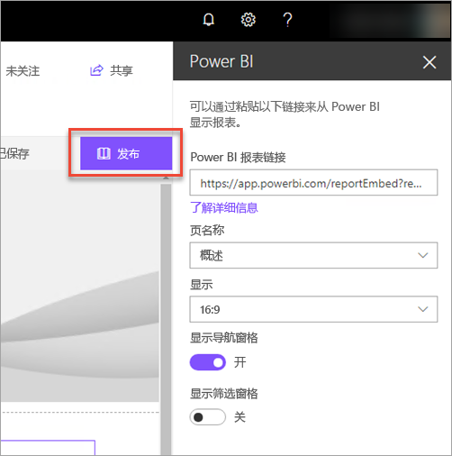
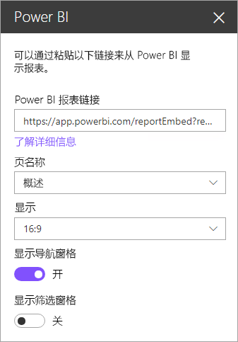
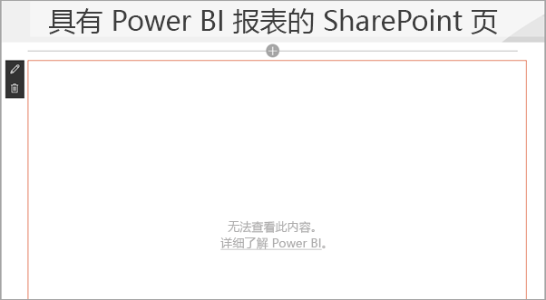

# 使用报表 Web 部件在 SharePoint Online 中嵌入报表

借助 Power BI 新推出的适用于 SharePoint Online 的报表 Web 部件，可以在 SharePoint Online 页面中轻松嵌入交互式 Power BI 报表。

使用新的“**在 SharePoint Online 中嵌入**”选项时，嵌入的报表绝对安全，因此你可以轻松创建安全的内部门户。

## 要求

若要让“**在 SharePoint Online 中嵌入**”报表正常呈现，需要满足一些要求。

* 适用于 SharePoint Online 的 Power BI Web 部件要求使用[新式页面](https://support.office.com/article/Allow-or-prevent-creation-of-modern-site-pages-by-end-users-c41d9cc8-c5c0-46b4-8b87-ea66abc6e63b)。

## 嵌入报表

若要将报表嵌入 SharePoint Online，必须先获取报表 URL，然后才能在 SharePoint Online 中将此 URL 用于新 Power BI Web 部件。

### 获取报表的 URL

1. 在 Power BI 服务中查看报表。

2. 选择“**文件**”菜单项。

3. 选择“在 SharePoint Online 中嵌入”。
   
    

4. 复制对话框中的 URL。

    

   > [!NOTE]
   > 还可以使用在查看报表时 Web 浏览器地址栏中显示的 URL。 此 URL 包含当前查看的报表页名称。 若要嵌入不同的页，需要从 URL 中删除报表部分。

### 将 Power BI 报表复制到 SharePoint Online 页面

1. 打开相应的 SharePoint Online 页面，然后选择“**编辑**”。

    

    或者，在 SharePoint Online 中选择“**+ 新建**”，新建新式网站页面。

    

2. 依次选择“+”和“Power BI”Web 部件。

    

3. 选择“**添加报表**”。

    

4. 将报表 URL 粘贴到属性窗格中。 这就是从上述步骤中复制的 URL。 此时，报表会自动加载。

    

5. 选择“**发布**”，让 SharePoint Online 用户可以看到此更改。

    

## 授予报表访问权限

在 SharePoint Online 中嵌入报表不会自动授予用户报表查看权限。 需要在 Power BI 服务中设置报表查看权限。

> [!IMPORTANT]
> 请务必在 Power BI 中检查哪些人员可以查看报表，然后向未列出的人员授予访问权限。

在 Power BI 服务中授予报表访问权限的方法有两种。 若要使用 Office 365 组生成 SharePoint Online 团队网站，请在 Power BI 服务中将用户列为应用工作区的成员。 这样就能确保用户可以查看相应组的内容。 有关详细信息，请参阅[在 Power BI 中创建和分发应用](service-create-distribute-apps.md)。

或者，可以按下列步骤来授予用户报表访问权限。

1. 将一个磁贴从报表添加到仪表板。

2. 与需要报表访问权限的用户共享此仪表板。 有关详细信息，请参阅[与同事和其他人共享仪表板](service-share-dashboards.md)。

## Web 部件设置

下面介绍了可以为适用于 SharePoint Online 的 Power BI Web 部件调整的设置。

| 属性 | 说明 |
| --- | --- |
| 页名称 |设置 Web 部件显示的默认页。 从下拉列表中选择一个值。 如果下拉列表中未显示任何页，要么是因为报表只有一页，要么是因为粘贴的 URL 包含页名称。 从 URL 中删除报表部分即可选择特定页。 |
| 显示 |用于调整报表如何能与 SharePoint Online 页面浑然一体的选项。 |
| 显示导航窗格 |显示或隐藏报表页导航窗格。 |
| 显示筛选窗格 |显示或隐藏筛选窗格。 |

## 多重身份验证

如果 Power BI 环境要求使用多重身份验证进行登录，系统可能会提示你使用安全设备登录，从而验证你的身份。 如果未使用多重身份验证登录 SharePoint Online，而 Power BI 环境又要求使用经过安全设备验证的帐户，就会发生这种情况。

> [!NOTE]
> Azure Active Directory 2.0 尚不支持多重身份验证。 用户会看到“*错误*”消息。 如果用户使用安全设备重新登录 SharePoint Online，则可以查看报表。

## 报表没有加载

Power BI Web 部件中可能无法加载报表，并显示以下消息。

*无法加载此内容。*

看见此消息的常见原因有两个。

1. 无权访问报表。
2. 报表已遭删除。

应与 SharePoint Online 页面的所有者联系，让其帮助你解决此问题。

## 已知问题和限制

* **错误：“出错，请尝试注销并重新登录，然后重新访问此页。相关 ID:未定义; http 响应状态: 400;服务器错误代码: 10001;消息:缺少刷新令牌”**
  
  如果看到此错误，请尝试执行下列一项操作。
  
  1. 注销并重新登录 SharePoint。 请务必在重新登录前关闭所有浏览器窗口。

  2. 如果用户帐户要求进行多重身份验证 (MFA)，请务必使用多重身份验证设备（如手机应用、智能卡等）登录 SharePoint
  
  3. 不支持 Azure B2B 来宾用户帐户。 用户将看到 Power BI 徽标，显示该部件正在加载，但它不会显示报表。

* Power BI 不支持 SharePoint Online 支持的本地化语言。 因此，可能无法在嵌入的报表中看到正确的本地化内容。

* 如果使用的是 Internet Explorer 10，可能会遇到问题。 可以查看 [Power BI 支持的浏览器](service-browser-support.md)和 [Office 365 支持的浏览器](https://products.office.com/office-system-requirements#Browsers-section)。

* Power BI Web 部件在[国家云](https://powerbi.microsoft.com/en-us/clouds/)中不可用。 

## 后续步骤

[允许或禁止最终用户创建新式网站页面](https://support.office.com/article/Allow-or-prevent-creation-of-modern-site-pages-by-end-users-c41d9cc8-c5c0-46b4-8b87-ea66abc6e63b)  
[在 Power BI 中构建和分发应用](service-create-distribute-apps.md)  
[与同事和其他人共享仪表板](service-share-dashboards.md)  
[Power BI Premium 有哪些特权？](service-premium.md)  

更多问题？ [尝试咨询 Power BI 社区](http://community.powerbi.com/) 

