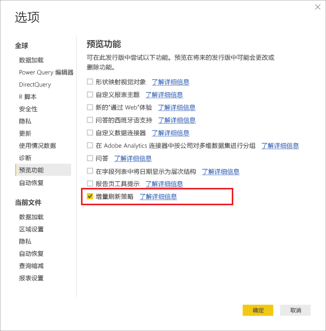
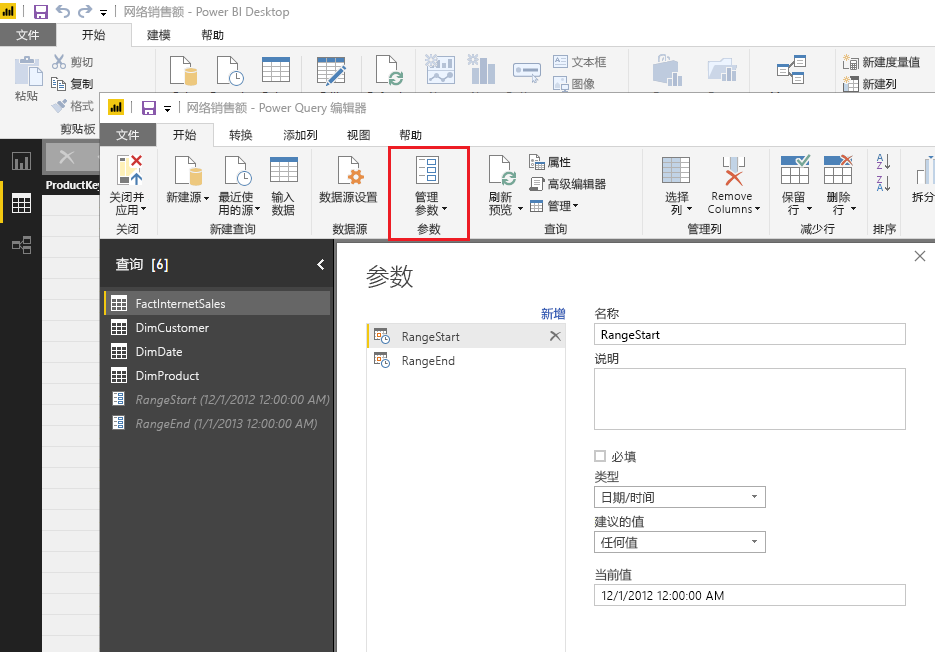
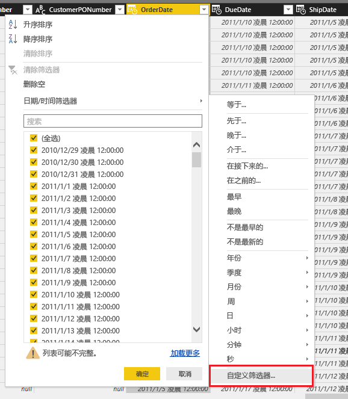
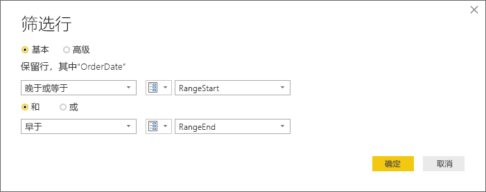
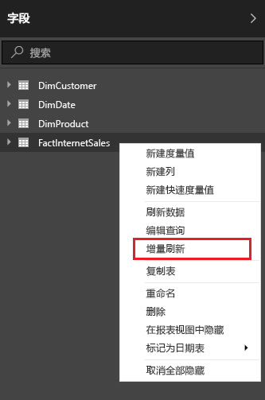
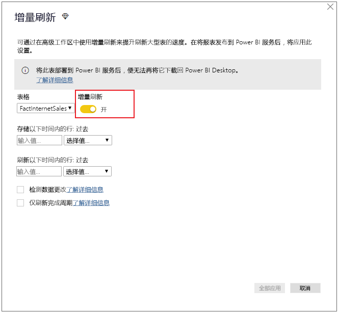
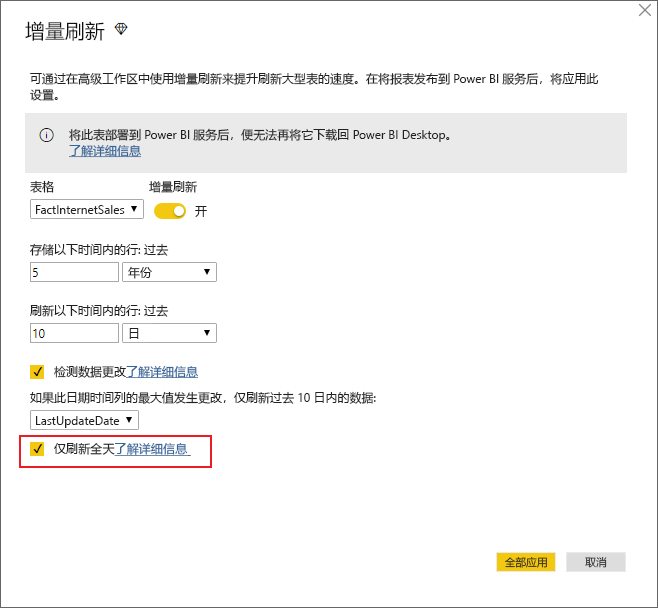
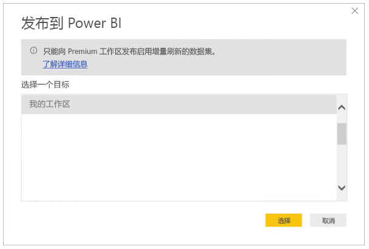

# <a name="incremental-refresh-in-power-bi-premium"></a>Power BI Premium 中的增量刷新

增量刷新功能可在 Power BI Premium 服务中启用大型数据集，且具备以下优势：

- **刷新速度更快。** 仅已更改的数据需要刷新。 例如，只刷新 10 年数据集中最近 5 天的数据。

- **刷新更可靠。** 例如，无需维护与不稳定的源系统的长期连接。

- **资源消耗更少。** 要刷新的数据量减少，这降低了内存和其他资源的整体消耗。

## <a name="how-to-use-incremental-refresh"></a>如何使用增量刷新

增量刷新策略在 Power BI Desktop 中进行定义，并在发布到 Power BI 服务后即刻应用。

首先启用预览版功能中的增量刷新。



### <a name="filter-large-datasets-in-power-bi-desktop"></a>在 Power BI Desktop 中筛选大型数据集

Power BI Desktop 可能不适合处理具有数十亿行的大型数据集，因为该软件通常受到用户台式电脑上可用资源的限制。 因此，这些数据集通常在导入时进行筛选以适应 Power BI Desktop。 不管是否使用增量刷新，情况都将如此。

#### <a name="rangestart-and-rangeend-parameters"></a>RangeStart 和 RangeEnd 参数

要利用 Power BI 服务中的增量刷新，需要使用名称为 RangeStart 和 RangeEnd 的 Power Query 日期/时间参数进行筛选（其中名称为保留名称且不区分大小写）。

在 Power Query 编辑器中，选择“管理参数”以使用默认值定义参数。



借助已定义的参数，可通过为列选择“自定义筛选器”菜单选项来应用筛选。



当列值在 RangeStart 上或其后且在 RangeEnd 之前时，请务必筛选行。



> [!TIP]
> 虽然参数的数据类型必须是日期/时间，但可进行转换以符合数据源的要求。 例如，下面的 Power Query 函数将日期/时间值转换为类似于 yyyymmdd 形式的整数代理键，这对数据仓库而言非常常见。 此函数可通过筛选步骤调用。
>
> `(x as datetime) => Date.Year(x)*10000 + Date.Month(x)*100 + Date.Day(x)`

在 Power Query 编辑器中选择“关闭并应用”。 必须具备 Power BI Desktop 中数据集的子集。

> [!NOTE]
> 发布后，Power BI 服务会自动替代参数值。 无需在数据集设置中进行设置。

### <a name="define-the-refresh-policy"></a>定义刷新策略

除实时连接模型外，表格的上下文菜单中提供增量刷新功能。



#### <a name="incremental-refresh-dialog"></a>“增量刷新”对话框

显示“增量刷新”对话框。 通过切换启用对话框。



> [!NOTE]
> 如果表格的 Power Query 表达式未引用具有保留名称的参数，则禁止切换。

标头文本说明了以下内容：

-   仅可在高级容量的工作区中使用增量刷新功能。 刷新策略是在 Power BI Desktop 中定义的，通过服务中的刷新操作进行应用。

-   即使能够从 Power BI 服务下载包含增量刷新策略的 PBIX 文件，也不可 Power BI Desktop 中打开该文件。 该文件即将取消下载。 虽然未来可能会支持此功能，但请记住，这些数据集可能变得很大，以至于无法在典型的台式电脑中下载和打开它们。

#### <a name="refresh-ranges"></a>刷新范围

以下示例定义了一个刷新策略，用于存储总共 5 年的数据，并以增量方式刷新 10 天的数据。 如果每天都要刷新数据集，则如下执行每个刷新操作。

-   添加新的一天的数据。

-   刷新截至当前日期的 10 天的数据。

-   删除比当前日期早 5 年的日历年的数据。 例如，如果当前日期为 2019 年 1 月 1 日，则删除 2013 年的数据。

Power BI 服务中的第一次刷新可能需要更长时间才能导入全部 5 年的数据。 随后的刷新用时可能很少。


如果上述范围的定义是你所需的全部内容，可直接转到下面的发布步骤。其他下拉菜单适用于高级功能。**

#### <a name="detect-data-changes"></a>检测数据更改

10 天的增量刷新当然比 5 年的完全刷新更有效。 但是，我们可能能够进一步改进。 如果选中“检测数据更改”复选框，则可选择用于仅标识和刷新数据更改日期的日期/时间列。 此操作假定源系统中存在通常用于审核的列。 将针对增量范围中的每个周期评估此列的最大值。 如果自上次刷新后未更改，则无需刷新周期。 在示例中，这可将增量刷新的天数从 10 天进一步减少到 2 天。


> [!TIP]
> 当前的设计要求将用于检测数据更改的列保留并缓存到内存中。 可能需要考虑采用以下某项技术来降低基数和内存消耗。
>
> 刷新时仅保留此列的最大值（可能是通过 Power Query 功能实现）。
>
> 根据刷新频率要求，将精度降低到可接受的水平。
>
> 我们计划在未来让用户能够针对数据更改检测进行自定义查询的定义。 这可用于完全避免保留列值。

#### <a name="only-refresh-complete-periods"></a>仅刷新完成周期

假设计划每天凌晨 4:00 运行刷新。 如果在这四个小时期间源系统中出现数据，则无需进行刷新。 对于某些天数而言，石油天然气行业的每日桶数等一些业务指标毫无意义。

再比如刷新财务系统中的数据，其中前一个月的数据在该月的第 12 个公历日获得批准。 可将增量范围设置为 1 个月，并安排在该月的第 12 天运行刷新。 选中此选项后，系统将在 2 月 12 日刷新 1 月份的数据。



> [!NOTE]
> 服务中的刷新操作在 UTC 时间下运行。 这可确定生效日期并对完成周期造成影响。 我们计划添加用于替代刷新操作生效日期的功能。

## <a name="publish-to-the-service"></a>发布到服务

由于增量刷新是高级版专用功能，因此发布对话框仅允许选择高级容量上的工作区。



现可刷新模型。 首次刷新可能需要更长时间来导入历史数据。 后续刷新使用增量刷新功能，因此速度可能大幅提升。

## <a name="query-timeouts"></a>查询超时

若要了解超时值如何对 Power BI 服务中的刷新操作进行限制，请参阅[刷新方案故障排除](https://docs.microsoft.com/power-bi/refresh-troubleshooting-refresh-scenarios)一文。 查询还受到数据源的默认超时值的限制。 大多数关系源允许重写 M 表达式中的超时值。 例如，以下表达式通过 [SQL Server 数据访问函数](https://msdn.microsoft.com/query-bi/m/sql-database)将其设置为 2 小时。 策略范围定义的每个周期提交一个查询，以观察命令超时设置。

```
let
    Source = Sql.Database("myserver.database.windows.net", "AdventureWorks", [CommandTimeout=#duration(0, 2, 0, 0)]),
    dbo_Fact = Source{[Schema="dbo",Item="FactInternetSales"]}[Data],
    #"Filtered Rows" = Table.SelectRows(dbo_Fact, each [OrderDate] >= RangeStart and [OrderDate] < RangeEnd)
in
    #"Filtered Rows"
```
