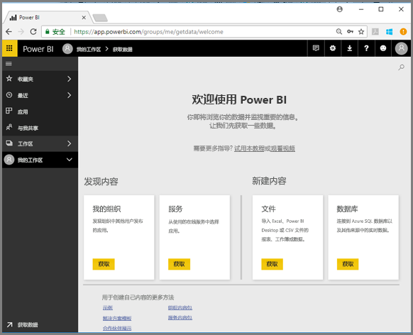
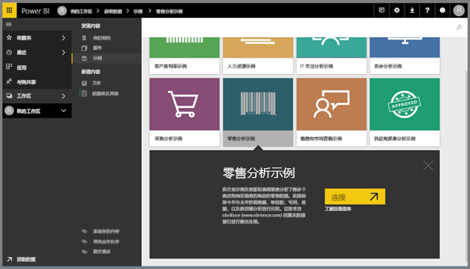
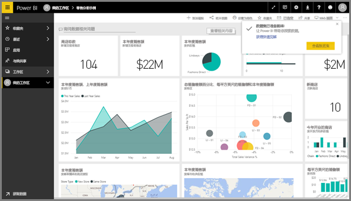
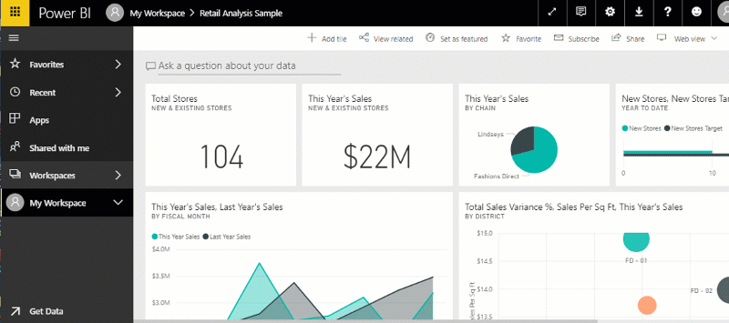
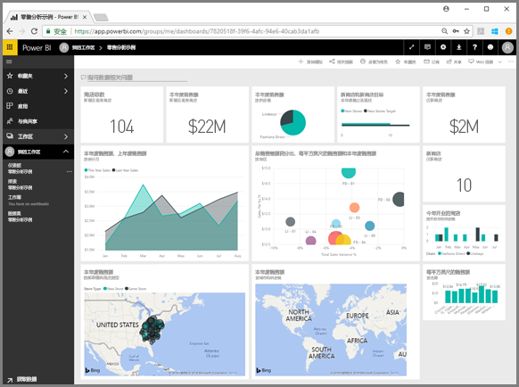
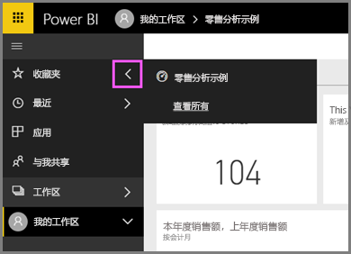
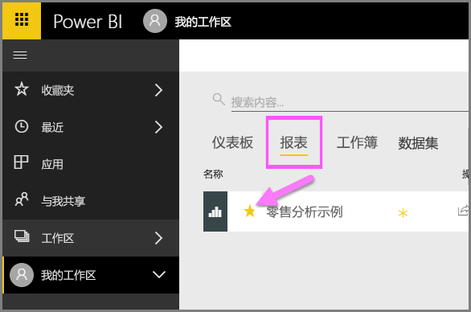
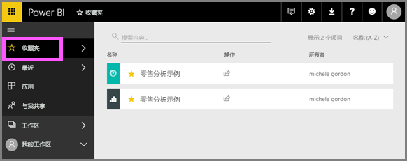
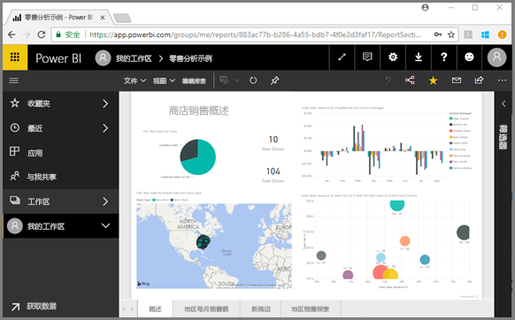
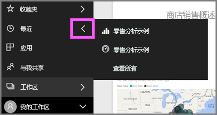

# 快速入门 - 使用 Power BI 服

现已掌握 Power BI 的基础知识，接下来了解 Power BI 服务。 如前所述，团队中有人可能将所有时间都花在 Power BI Desktop 上，为其他人合并数据和创建报表。 但在另一方面，你的时间可能都花在 Power BI 服务上，你要查看其他人创建的内容并与之交互（使用体验），或者获取数据和自行创建报表及仪表板（创造体验）。 在此快速入门教程中，将导入示例数据并使用该数据来了解 Power BI 服务的使用方式。 
 
## 先决条件

- 如果未注册 Power BI，请[免费注册](https://app.powerbi.com/signupredirect?pbi_source=web)后再进行操作。

- 了解 [Power BI 服务的基本概念](service-basic-concepts.md)

## 打开 Power BI 服务并获取一些数据
我们将获取一些用于 Power BI 服务教程的示例数据。 我们提供了各种类型的示例数据供你浏览，这次我们将使用零售店数据。    
1. 打开 app.powerbi.com，然后选择“示例”的链接。 

    

2. 依次选择“零售分析示例”和“连接”。

    

    Power BI 服务导入示例并显示仪表板。 仪表板可区分 Power BI 服务和 Power BI Desktop。 该示例还包含一个报表和数据库（稍后将用到）。

    

请观看下面的视频，Amanda 将带你感受 Power BI 服务导航体验。  然后，按照视频下方的分步说明操作，自行进行探索。

<iframe width="560" height="315" src="https://www.youtube.com/embed/G26dr2PsEpk" frameborder="0" allowfullscreen></iframe>

## 查看内容（仪表板、报表、工作簿、数据集、工作区、应用）
让我们先来看看基本内容（仪表板、报表、数据集、工作簿）的组织方式。 在工作区的上下文中显示内容。 此时，只有一个工作区（称为“我的工作区”。 “我的工作区”存储你拥有的所有内容。 可以将其作为你的个人沙盒或自己内容的工作区域。 你可以与同事共享“我的工作区”中的内容。 在“我的工作区”中，内容由 4 个选项卡组成：仪表板、报表、工作簿和数据集。

从左侧导航窗格（左侧导航窗格）中选择工作区后，关联内容（仪表板、报表、工作簿、数据集）的选项卡在 Power BI 画布右侧显示。

如果是新用户，则只能看到一个工作区，即“我的工作区”。

在这些选项卡（又名“内容视图”）中，可查看内容相关信息以及可对其执行的操作。  例如，可在“仪表板”选项卡中打开仪表板、共享、删除、搜索、创建新内容和进行排序等。

通过选择仪表板名称打开仪表板。

## 收藏仪表板和报表
利用收藏夹能快速访问你认为最重要的内容。  

1. 在打开的仪表板中，选择右上角的“收藏夹”。
   
   
   
   此时，“**收藏**”变为“**取消收藏**”，星标变为黄色。
   
   

2. 要显示已加入收藏夹的所有内容的列表，请在左侧导航窗格中选择“收藏夹”右侧的箭头。 由于左侧导航窗格是 Power BI 服务的永久性功能，因此可以在 Power BI 服务中的任何位置访问此列表。
   
    
   
    到目前为止，我们只有一个收藏夹。 收藏夹可以是仪表板、报表或应用。  

1. 另一种将仪表板或报表标记为收藏的方法是利用“仪表板”或“报表”工作区选项卡。打开“报表”选项卡，然后选择报表名称左侧的星形图标。
   
   

3. 通过选择左侧导航栏中的“收藏夹”或选择星形图标 ，打开“收藏夹”窗格。
   
   
   
   现在有两个收藏夹：一个仪表板和一个报表。 可在此处打开、搜索、取消收藏或与同事共享内容。

4. 选择报表名称，在报表编辑器中将其打开。

    

要了解详细信息，请参阅[收藏](service-dashboard-favorite.md)

## 查找最新内容

1. 与收藏夹类似，通过选择左侧导航窗格中“最近访问的内容”旁边的箭头，可在 Power BI 服务中的任意位置快速查看最近访问的内容。

   

    在浮出控件中选择内容将其打开。

2. 有时，你不想打开最近访问的内容，而是希望查看信息或执行其他操作，例如共享、运行见解或导出到 Excel。 在此类情况下，可通过从左侧导航栏中选择“最近访问的内容”或其图标，打开“最近访问的内容”窗格。 如果有多个工作区，则此列表显示来自所有工作区的内容。

   

若要了解详细信息，请参阅[Power BI 中最近使用的项目](service-recent.md)

### 对内容进行搜索和排序
借助内容视图，可以更轻松地对内容进行搜索、筛选和排序。 若要搜索仪表板、报表或工作簿，请在搜索区域中键入内容。 Power BI 会筛选出名称中包含搜索字符串的内容。

由于只有一个示例，因此无需搜索和排序。  但是如果列表上具有大量仪表板、报表、工作簿和数据集，你将发现搜索和排序非常有用。

也可以按名称或所有者对内容进行排序。  

若要了解详细信息，请参阅 [Power BI 导航：搜索、排序、筛选](service-navigation-search-filter-sort.md)

## 清理资源
完成此快速入门后，如果需要，可以删除零售分析示例仪表板、报表和数据集。

1. 打开 Power BI 服务 (app.powerbi.com) 并登录。    
2. 在左侧的导航窗格中，选择“工作区”>“我的工作区”。  
    观察是否存在指示它为收藏项的黄星    
3. 在“仪表板”选项卡下，选择零售分析仪表板旁边的垃圾桶“删除”图标。    

    

4. 依次选择“报表”选项卡和零售分析报表。
1. 依次选择“数据集”选项卡和零售分析数据集。

## 后续步骤

> [!div class="nextstepaction"]
> [Power BI 服务中的“阅读视图”和“编辑视图”](./service-reading-view-and-editing-view.md)