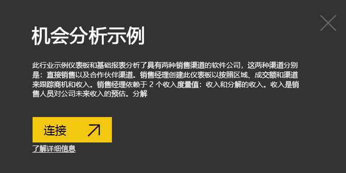
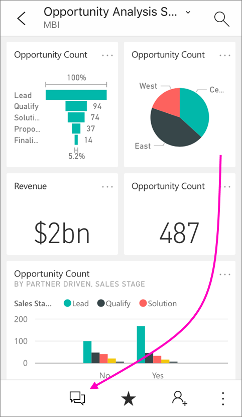

# 教程：在 iOS 应用 Power BI 中向常见问题虚拟分析师询问关于数据的问题

了解数据的最简单方式是用自己的话咨询有关数据的问题。 在本教程中，在 iPad、iPhone 和 iPod Touch 上的 Microsoft Power BI 移动应用中向常见问题虚拟分析师询问关于示例数据的问题并查看特别推荐的见解。 

适用于：

|  |  |
|:--- |:--- |
| iPhone |iPad |

常见问题虚拟分析师是可在 Power BI 服务 [(https://powerbi.com)](https://powerbi.com) 中访问基础常见问题数据的对话 BI 体验。 它会提供数据见解建议，你可以键入或说出自己的问题。

在本教程中，你将执行下列操作：

> [!div class="checklist"]
> * 安装 iOS 版 Power BI 移动应用
> * 下载 Power BI 示例仪表板和报表
> * 查看移动应用建议的特别推荐的见解

如果未注册 Power BI，请[免费注册](https://app.powerbi.com/signupredirect?pbi_source=web)后再进行操作。

## 先决条件

### 安装 iOS 版 Power BI 应用
[下载 iOS 应用](http://go.microsoft.com/fwlink/?LinkId=522062 "从 Apple App Store 下载 iPhone 应用") 到你的 iPad、iPhone 或 iPod Touch 中。

以下版本支持 iOS 版 Power BI 应用：
- 操作系统为 iOS 10 或更高版本的 iPad。
- 操作系统为 iOS 10 或更高版本的 iPhone 5 及更高版本。 
- 操作系统为 iOS 10 或更高版本的 iPod Touch。

### 下载机会分析示例
教程中的第一步是在 Power BI 服务中下载机会分析示例。

1. 在浏览器 (app.powerbi.com) 中打开 Power BI 服务，然后登录。

1. 选择全局导航图标以打开左侧导航。

    

2. 在左侧的导航窗格中，选择“工作区” > “我的工作区”。

    

3. 在左下角，选择“获取数据”。
   
    

3. 在“获取数据”页上选择“示例”图标。
   
   

4. 选择“机会分析示例”。
 
    
 
8. 选择“连接”。  
  
   
   
5. Power BI 导入示例，并将新的仪表板、报表和数据集添加到“我的工作区”。
   
   

好了，你已准备好在 iOS 设备上查看示例。

## 尝试“特别推荐的见解”
1. 在 iPhone 或 iPad 上，打开 Power BI 应用，并使用在浏览器中的 Power BI 服务中所用的 Power BI 帐户凭据进行登录。

1.  点击全局导航按钮 > “工作区” > “我的工作区”，然后打开“机会分析示例”仪表板。

2. 点击问答虚拟分析师图标  。

     

     Power BI 问答虚拟分析师推荐了一些可快速上手的见解。

     
3. 点击“特别推荐的见解”。

     问答虚拟分析师推荐了一些见解。
4. 向右滚动，再点击“见解 2”。

    

     此时，问答虚拟分析师会显示“见解 2”。

    
5. 点击图表，在焦点模式下打开它。

    
6. 点击左上角的箭头，可返回到问答虚拟分析师体验。

## 清理资源

完成教程后，可以删除“机会分析示例”仪表板、报表和数据集。

1. 打开 Power BI 服务 (app.powerbi.com) 并登录。

2. 在左侧的导航窗格中，选择“工作区” > “我的工作区”。

3. 在“仪表板”选项卡上，选择“机会分析”仪表板旁边的垃圾桶“删除”图标。

    

4. 依次选择“报表”选项卡和“机会分析”报表。

5. 依次选择“数据集”选项卡和“机会分析”数据集。

## 后续步骤

你已在 iOS 版 Power BI 移动应用中尝试常见问题虚拟助手。 了解有关 Power BI 服务中常见问题的详细信息。
> [!div class="nextstepaction"]
> [Power BI 服务中的问答](power-bi-q-and-a.md)

